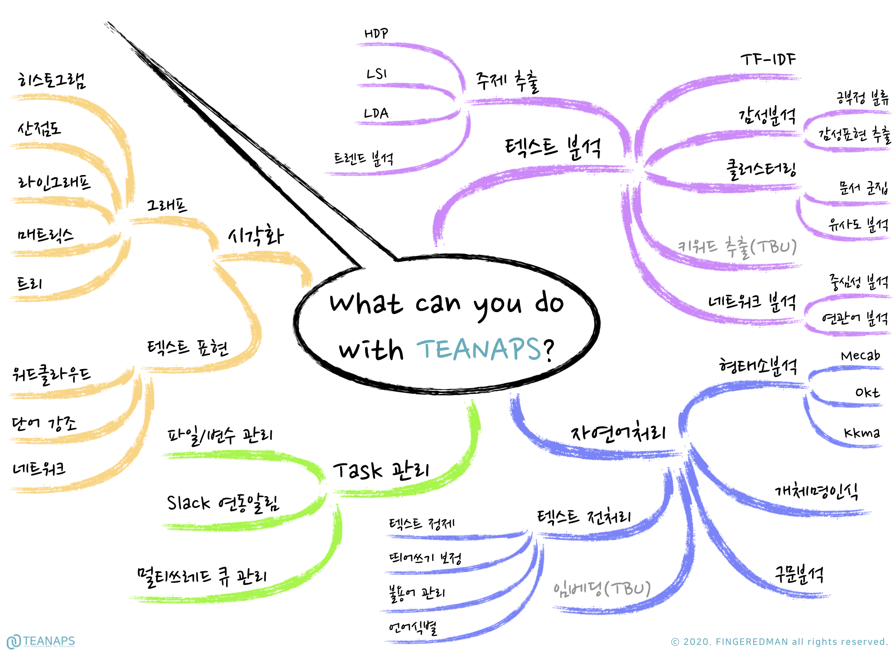

# `TEANAPS`: Text Analysis APIs
> 

> 본 자료는 텍스트 마이닝(text mining)에 보다 쉽게 접근할 수 있도록 도와주는 `Python` 라이브러리 입니다. 텍스트 마이닝을 위해서는 `Python` 언어를 배운 후에도 다양한 라이브러리를 활용할 줄 알아야합니다(e.g., KoNLPy, NLTK, Gensim). 하지만 배워야하는 외부 라이브러리가 적지않고 난이도도 높아 `Python` 언어에 충분히 익숙하지 않으신 분들은 접근하기가 쉽지 않습니다.  
`TEANAPS`는 텍스트 마이닝과 관련된 외부 라이브러리들을 하나의 인터페이스(API) 형태로 통합하고 `Google Colabotory`를 활용해 설치환경을 통일하여, 텍스트 마이닝을 위한 사전작업을 최소화하고 필요한 프로그래밍 코드를 최소화 할 수 있도록 도와줍니다. 본 패키지를 활용하기 전 `Python` 기초문법과 텍스트 마이닝에 필요한 필수 사전지식을 먼저 학습하시기를 추천드리며, [`User Guide`](./document/teanaps_user_guide-install_teanaps.md#teanaps-user-guide)와 [`Tutorial`](./document/teanaps_user_guide-tutorial.md#teanaps-user-guide)을 참조하시어 `TEANAPS` 활용법을 따라해보시길 권장드립니다.

- 본 자료는 텍스트 마이닝을 활용한 연구 및 강의를 위한 목적으로 제작되었습니다.
- 본 자료를 강의 또는 연구 목적으로 활용하고자 하시는 경우 꼭 아래 메일주소로 연락주세요.
- 본 자료에 대한 <U>상업적 활용과 허가되지 않은 배포를 금지</U>합니다.
- 강의, 저작권, 출판, 특허, 공동저자에 관련해서는 문의 바랍니다.
- **Contact : ADMIN(admin@teanaps.com)**

---
## Notice! 
> - 본 자료는 2019년 부터 연세대학교 <데이터분석 아카데미: 비정형 데이터 분석>, <텍스트 마이닝: 비정형 데이터 분석> 강의 실습자료로 활용되고 있습니다.
> - `TEANAPS` 라이브러리 사용법은 [`User Guide`](./document/teanaps_user_guide-install_teanaps.md#teanaps-user-guide)를 참조해주시기 바랍니다.
> - [`TEANAPS`를 활용해 하루만에 챗봇 구현하기](http://chat.teanaps.com) 프로젝트가 업로드 되었습니다.  

---
## What can you do with `TEANAPS`?
> 

> `#teanaps` `#티냅스_라고_불러주세요` `#텍스트분석` `#텍스트마이닝` `#자연어처리` `#텍스트전처리` `#띄어쓰기_보정` `#불용어` `#언어식별` `#임베딩` `#형태소분석` `#개체명인식` `#구문분석` `#TF-IDF` `#감성분석` `#긍부정` `#긍부정_키워드` `#클러스터링` `#군집화` `#문서분류` `#유사도분석` `#네트워크` `#중심성` `#연관키워드` `#키워드추출`
 
---
## Why `TEANAPS`?

- `TEANAPS`를 활용하면 최대 70% 까지 <U>**분석코드를 간소화**</U>할 수 있습니다. ([분석코드 살펴보기](./document/teanaps_user_guide-api_documentation-handler.md#teanaps-user-guide))
- `TEANAPS`는 최신 언어모델을 적용해 오픈소스 패키지 대비 <U>**높은 퍼포먼스**</U>를 제공합니다. ([성능평가 결과 살펴보기](./document/teanaps_user_guide-appendix.md#teanaps-성능평가-결과))
- `TEANAPS`는 분석결과를 효과적으로 표현하기 위한 <U>**다양한 시각화**</U>를 제공합니다. ([시각화 기능 살펴보기](./document/teanaps_user_guide-api_documentation-visualization.md#4-teanapsvisualization))
- `TEANAPS`는 <U>**OPEN API**</U>를 통해 다양한 환경에서 텍스트 분석을 지원합니다.
- `TEANAPS`는 텍스트 분석을 위한 <U>**[`User Guide`](./document/teanaps_user_guide-install_teanaps.md#teanaps-user-guide), [강의 및 실습자료](https://github.com/fingeredman/text-mining-for-practice)**</U>를 무료로 제공합니다.
- `TEANAPS`는 다양한 도메인의 <U>**`프로젝트/연구`**</U>를 무료로 지원합니다. (Contact : ADMIN(admin@teanaps.com))

---
## `TEANAPS` User Guide

### Contents
- [Install `TEANAPS`](./document/teanaps_user_guide-install_teanaps.md#teanaps-user-guide)
- [API Documentation](./document/teanaps_user_guide-api_documentation-handler.md#teanaps-user-guide)
- [`TEANAPS` OPEN API](./document/teanaps_user_guide-rest_api.md#teanaps-user-guide)
- [Tutorial](./document/teanaps_user_guide-tutorial.md#teanaps-user-guide)
- [References](./document/teanaps_user_guide-references_journal_project.md#teanaps-user-guide)
- [Journal & Project](./document/teanaps_user_guide-references_journal_project.md#teanaps-user-guide)
- [Appendix](./document/teanaps_user_guide-appendix.md#teanaps-user-guide)

---
## `TEANAPS` Tutorial
- [튜토리얼 문서](./document/teanaps_user_guide-tutorial.md#teanaps-user-guide)를 참조해주세요.
- `TEANAPS`를 활용한 다양한 텍스트 분석 방법은 [`ADVANCED TEXT MINING`](https://github.com/fingeredman/advanced-text-mining#advanced-text-mining), [`TEXT MINING for PRACTICE`](https://github.com/fingeredman/text-mining-for-practice#text-mining-for-practice) 자료를 참고해주세요.

---
## Release history
> 2020.12.12. `teanaps v0.9.3` 업데이트  
> 2020.11.15. `teanaps v0.9.2` 업데이트  
> 2020.11.07. `teanaps v0.9.1` 업데이트  
> 2020.10.17. `teanaps v0.8.1` 업데이트  
> 2020.08.22. `teanaps v0.7.2` 업데이트  
> 2020.08.22. `teanaps v0.7.1` 업데이트  
> 2020.02.29. `teanaps v0.6.1` 업데이트  
> 2020.01.11. `teanaps v0.5.2` 업데이트  
> 2020.01.04. `teanaps v0.5.1` 업데이트  
> 2019.12.21. `teanaps v0.4.3` 업데이트  
> 2019.12.07. `teanaps v0.4.2` 업데이트  
> 2019.11.23. `teanaps v0.4.1` 업데이트  
> 2019.11.09. `teanaps v0.3.3` 업데이트  
> 2019.10.13. `teanaps v0.3.2` 업데이트  
> 2019.09.22. `teanaps v0.3.1` 업데이트  
> 2019.08.21. `teanaps v0.2.1` 업데이트  
> 2019.07.12. `teanaps v0.1.1` 업데이트   

---
## Update History
> 2020.10.10. `TEANAPS` API 서버 안정화 작업 및 업데이트  
> 2020.05.02. `TEANAPS` API 서버 안정화 작업 및 업데이트  
> 2020.03.07. `REST API` 문서 업데이트  
> 2020.02.08. `Documentation` 업데이트  
> 2020.02.02. `Documentation` 업데이트  
> 2020.01.11. `Documentation` 업데이트  
> 2020.01.04. `User Guide` 업로드  
> 2019.11.09. `REST API` 문서 초안 업로드  
> 2019.08.24. `install.ipynb` 업데이트  
> 2019.08.21. `install.ipynb` 업로드  
> 2019.06.12. 기본 구성 입력  

  
---

ⓒ 2020. FINGEREDMAN rights reserved.

