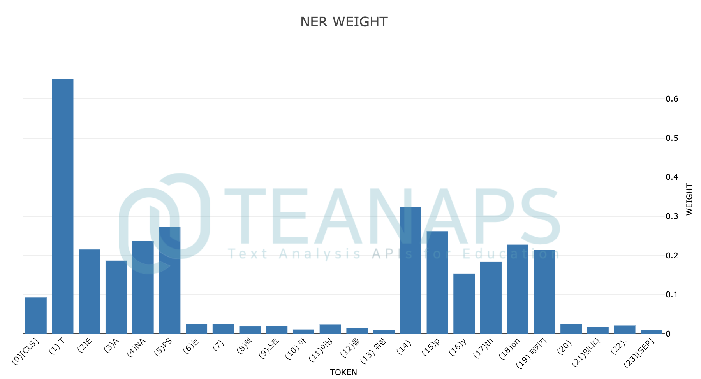
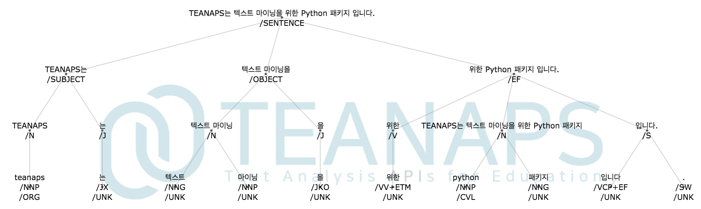

# `TEANAPS` User Guide

---
## Contents
- [Install `TEANAPS`](./teanaps_user_guide-install_teanaps.md)
- [API Documentation](./teanaps_user_guide-api_documentation-handler.md)
  - [Handler](./teanaps_user_guide-api_documentation-handler.md)
  - [NLP](./teanaps_user_guide-api_documentation-nlp.md)
  - [Text Analysis](./teanaps_user_guide-api_documentation-text_analysis.md)
  - [Visualization](./teanaps_user_guide-api_documentation-visualization.md)
  - [Machine Learning](./teanaps_user_guide-api_documentation-visualization.md)
- [Tutorial](./teanaps_user_guide-tutorial.md)
- [References](./teanaps_user_guide-references_journal_project.md)
- [Journal & Project](./teanaps_user_guide-references_journal_project.md)
- [Appendix](./teanaps_user_guide-appendix.md)

---
## API Documentation

### `TEANAPS` Architecture

```python
├─teanaps  
│     │  
│     ├─ handler  
│     │     ├─ FileHandler  
│     │     ├─ MessageHandler  
│     │     └─ QueueHandler  
│     │  
│     ├─ nlp
│     │     ├─ MorphologicalAnalyzer
│     │     ├─ NamedEntityRecognizer
│     │     ├─ SyntaxAnalyzer 
│     │     ├─ Processing 
│     │     └─ Embedding 
│     │ 
│     ├─ text_analysis 
│     │     ├─ TfidfCalculator 
│     │     ├─ DocumentClustering
│     │     ├─ TopicClustering 
│     │     ├─ CoWordCalculator
│     │     ├─ SentimentAnalysis
│     │     ├─ DocumentSummarizer 
│     │     └─ KeyphraseExtraction
│     │  
│     ├─ visualization
│     │     ├─ GraphVisualizer
│     │     └─ TextVisualizer 
│     │  
│     └─ machine_learning
│           ├─ Regression
│           ├─ Classification
│           └─ Clustering
└─────────────────────────────────────────
```

### Jump to

| Package   | Class     |
|-----------|-----------|
| [handler](./teanaps_user_guide-api_documentation-handler.md#1-teanapshandler)    | [FileHandler](./teanaps_user_guide-api_documentation-handler.md#11-teanapshandlerfilehandler), [MessageHandler](./teanaps_user_guide-api_documentation-handler.md#12-teanapshandlermessagehandler), [QueueHandler](./teanaps_user_guide-api_documentation-handler.md#13-teanapshandlerqueuehandler)    |
| [nlp](./teanaps_user_guide-api_documentation-nlp.md#2-teanapsnlp)    | [MorphologicalAnalyzer](./teanaps_user_guide-api_documentation-nlp.md#21-teanapsnlpmorphologicalanalyzer), [NamedEntityRecognizer](./teanaps_user_guide-api_documentation-nlp.md#22-teanapsnlpnamedentityrecognizer), [SyntaxAnalyzer](./teanaps_user_guide-api_documentation-nlp.md#23-teanapsnlpsyntaxanalyzer), [Processing](./teanaps_user_guide-api_documentation-nlp.md#24-teanapsnlpprocessing), [Embedding](./teanaps_user_guide-api_documentation-nlp.md#25-teanapsnlpembedding)    |
| [text_analysis](./teanaps_user_guide-api_documentation-text_analysis.md#3-teanapstext_analysis)    | [TfidfCalculator](./teanaps_user_guide-api_documentation-text_analysis.md#31-teanapstext_analysistfidfcalculator), [DocumentClustering](./teanaps_user_guide-api_documentation-text_analysis.md#32-teanapstext_analysisdocumentclustering), [TopicClustering](./teanaps_user_guide-api_documentation-text_analysis.md#33-teanapstext_analysistopicclustering), [CoWordCalculator](./teanaps_user_guide-api_documentation-text_analysis.md#34-teanapstext_analysiscowordcalculator), [SentimentAnalysis](./teanaps_user_guide-api_documentation-text_analysis.md#35-teanapstext_analysissentimentanalysis), [DocumentSummarizer](./teanaps_user_guide-api_documentation-text_analysis.md#36-teanapstext_analysisdocumentsummarizer), [KeyphraseExtraction](./teanaps_user_guide-api_documentation-text_analysis.md#37-teanapstext_analysiskeyphraseextraction)    |
| [visualization](./teanaps_user_guide-api_documentation-visualization.md#4-teanapsvisualization)    | [GraphVisualizer](./teanaps_user_guide-api_documentation-visualization.md#41-teanapsvisualizationgraphvisualizer), [TextVisualizer](./teanaps_user_guide-api_documentation-visualization.md#42-teanapsvisualizationtextvisualizer)    |
| [machine_learning](./teanaps_user_guide-api_documentation-visualization.md#5-teanapsmachine_learning)    | [Regression](./teanaps_user_guide-api_documentation-visualization.md#51-teanapsmachine_learningregression), [Classification](./teanaps_user_guide-api_documentation-visualization.md#52-teanapsmachine_learningclassification), [Clustering](./teanaps_user_guide-api_documentation-visualization.md#53-teanapsmachine_learningclustering)    |

### Manual
#### 2. `teanaps.nlp`
##### 2.1. `teanaps.nlp.MorphologicalAnalyzer`  

> Python Code (in Jupyter Notebook) :
> ```python
> from teanaps.nlp import MorphologicalAnalyzer
>
> ma = MorphologicalAnalyzer()
> ```

> Notes :  
> - import시 최초 1회 경고메시지 (Warnning)가 출력될 수 있습니다. 무시하셔도 좋습니다.

- `teanaps.nlp.MorphologicalAnalyzer.parse(sentence)` [[Top]](#teanaps-architecture)
  - 문장을 형태소 분석하고 그 결과를 반환합니다.
  - Parameters
    - *sentence (str) : 한국어 또는 영어로 구성된 문장. 최대 128자.*
  - Returns
    - *result (list) : (형태소, 품사, 단어위치) 구조의 Tuple을 포함하는 리스트.*
  - Examples

    > Python Code (in Jupyter Notebook) :
    > ```python
    > sentence = "TEANAPS는 텍스트 마이닝을 위한 Python 패키지 입니다."
    > result = ma.parse(sentence)
    > print(result)
    > ```
    > Output (in Jupyter Notebook) :
    > ```python
    > [('TEANAPS', 'OL', (0, 7)), ('는', 'VV', (7, 8)), ('텍스트', 'NNG', (9, 12)), ('마', 'NNG', (13, 14)), ('이닝', 'NNG', (14, 16)), ('을', 'JC', (16, 17)), ('위', 'NNG', (18, 19)), ('한', 'JC', (19, 20)), ('Python', 'OL', (21, 27)), ('패키지', 'NNG', (28, 31)), ('입니다', 'VA', (32, 35)), ('.', 'SW', (35, 36))]
    > ```

    > Notes :  
    > - `TEANAPS`의 품사태그는 세종말뭉치 품사태그를 기본으로 사용합니다. 품사태그표는 [Appendix](./teanaps_user_guide-appendix.md#teanaps-형태소-품사태그표)를 참고해주세요.

- `teanaps.nlp.MorphologicalAnalyzer.set_tagger(tagger)` [[Top]](#teanaps-architecture)
  - 형태소 분석기를 선택합니다. 형태소 분석기는 `MeCab`, `Okt (Twitter)`, `Kkma`, `NLTK` 총 4가지를 지원합니다. 형태소 분석기를 선택하지 않으면 기본으로 한국어는 `OKt`, 영어는 `NLTK` 형태소 분석기를 사용합니다.
  - Parameters
    - *tagger (str) : 형태소 분석기 {"okt", "mecab", "kkma"} 중 하나 입력.*
  - Returns
    - *None*
  - Examples

    > Python Code (in Jupyter Notebook) :
    > ```python
    > ma.set_tagger("okt")
    > # or ma.set_tagger("mecab")
    > # or ma.set_tagger("kkma")
    >
    > sentence = "TEANAPS는 텍스트 마이닝을 위한 Python 패키지 입니다."
    > result = ma.parse(sentence)
    > print(result)
    > ```
    > Output (in Jupyter Notebook) :
    > ```python
    > [('TEANAPS', 'OL', (0, 7)), ('는', 'JX', (7, 8)), ('텍스트', 'NNG', (9, 12)), ('마이닝', 'NNP', (13, 16)), ('을', 'JKO', (16, 17)), ('위한', 'VV+ETM', (18, 20)), ('Python', 'OL', (21, 27)), ('패키지', 'NNG', (28, 31)), ('입니다', 'VCP+EF', (32, 35)), ('.', 'SW', (35, 36))]
    > ```

##### 2.2. `teanaps.nlp.NamedEntityRecognizer`

> Python Code (in Jupyter Notebook) :
> ```python
> from teanaps.nlp import NamedEntityRecognizer
>
> ner = NamedEntityRecognizer(model_path="/model")
> ```

> Notes :  
> - 모델 파일을 별도로 [다운로드](https://drive.google.com/open?id=1qZ5qttjvRhHiQesECRQc6JgB4_kAcVBr)하여 파일 경로를 `model_path` 변수에 포함해야합니다.
> - import시 최초 1회 경고메시지 (Warnning)가 출력될 수 있습니다. 무시하셔도 좋습니다.

- `teanaps.nlp.NamedEntityRecognizer.parse(sentence)` [[Top]](#teanaps-architecture)
  - 문장에서 개체명을 인식하고 그 결과를 반환합니다.
  - Parameters
    - *sentence (str) : 한국어 또는 영어로 구성된 문장. 최대 128자.*
  - Returns
    - *result (list) : (개체명, 개체명 태그, 개체명위치) 구조의 Tuple을 포함하는 리스트.*
  - Examples

    > Python Code (in Jupyter Notebook) :
    > ```python
    > sentence = "TEANAPS는 텍스트 마이닝을 위한 Python 패키지 입니다."
    > result = ner.parse(sentence)
    > print(result)
    > ```
    > Output (in Jupyter Notebook) :
    > ```python
    > [('TEANAPS', 'UN', (0, 7)), ('Python', 'UN', (21, 27))]
    > ```

    > Notes :  
    > - `TEANAPS`의 개체명 태그는 총 16종으로 구분됩니다. 태그 종류 및 구분은 [정보통신단체표준 (TTAS)](http://committee.tta.or.kr/data/standard_view.jsp?nowPage=32&pk_num=TTAK.KO-10.0852&nowSu=318&rn=1)을 따릅니다.
    > - 개체명 태그표는 [Appendix](./teanaps_user_guide-appendix.md#teanaps-개체명-태그표)를 참고해주세요.

- `teanaps.nlp.NamedEntityRecognizer.parse_sentence(sentence)` [[Top]](#teanaps-architecture)
  - 문장에서 개체명을 인식하고 그 결과를 반환합니다.
  - Parameters
    - *sentence (str) : 한국어 또는 영어로 구성된 문장. 최대 128자.*
  - Returns
    - *result (str) : 표준 개체명 태그 형식으로 개체명 태깅된 문장.*
  - Examples

    > Python Code (in Jupyter Notebook) :
    > ```python
    > sentence = "TEANAPS는 텍스트 마이닝을 위한 Python 패키지 입니다."
    > result = ner.parse_sentence(sentence)
    > print(result)
    > ```
    > Output (in Jupyter Notebook) :
    > ```python
    > "<TEANAPS:UN>는 텍스트 마이닝을 위한 <Python:UN> 패키지 입니다."
    > ```

- `teanaps.nlp.NamedEntityRecognizer.get_weight(sentence)` [[Top]](#teanaps-architecture)
  - 문장에서 개체명을 인식하고 각 형태소별 가중치를 반환합니다.
  - Parameters
    - *sentence (str) : 한국어 또는 영어로 구성된 문장. 최대 128자.*
  - Returns
    - *result (str) : token_list, weight_list가 포함된 딕셔너리.*
  - Examples

    > Python Code (in Jupyter Notebook) :
    > ```python
    > sentence = "TEANAPS는 텍스트 마이닝을 위한 Python 패키지 입니다."
    > result = ner.get_weight(sentence)
    > print(result)
    > ```
    > Output (in Jupyter Notebook) :
    > ```python
    > {
    >   'token_list': ['[CLS]', ' T', 'E', 'A', 'NA', 'PS', '는', ' ', '텍', '스트', ' 마', '이닝', '을', ' 위한', ' P', 'y', 'th', 'on', ' 패키지', ' ', '입니다', '.', '[SEP]'], 
    >   'weight_list': [0.3576193153858185, 0.41024893522262573, 0.08311055600643158, 0.1084287092089653, 0.1453726887702942, 0.25153452157974243, 0.004453524947166443, 0.0038948641158640385, 0.0018726392881944776, 0.0029991772025823593, 0.0017985135782510042, 0.001928122597746551, 0.0021339845843613148, 0.0020090234465897083, 0.14324823021888733, 0.20584315061569214, 0.11403589695692062, 0.14470143616199493, 0.09357250481843948, 0.0024957722052931786, 0.0019250106997787952, 0.004643643740564585, 0.004450325388461351]
    > }
    > ```

- `teanaps.nlp.NamedEntityRecognizer.draw_sentence_weight(sentence)` [[Top]](#teanaps-architecture)
  - 문장에서 개체로 인식된 형태소에 대한 가중치를 text attention 그래프로 출력합니다.
  - Parameters
    - *sentence (str) : 한국어 또는 영어로 구성된 문장. 최대 128자.*
  - Returns
    - *plotly graph (graph object) : 문장에서 개체로 인식된 부분에 대한 가중치 그래프.*
  - Examples

    > Python Code (in Jupyter Notebook) :
    > ```python
    > sentence = "TEANAPS는 텍스트 마이닝을 위한 Python 패키지 입니다."
    > result = ner.draw_weight(sentence)
    > ```
    > Output (in Jupyter Notebook) :  
    > 

- `teanaps.nlp.NamedEntityRecognizer.draw_weight(sentence)` [[Top]](#teanaps-architecture)
  - 문장에서 개체로 인식된 형태소에 대한 가중치를 히스토그램으로 출력합니다.
  - Parameters
    - *sentence (str) : 한국어 또는 영어로 구성된 문장. 최대 128자.*
  - Returns
    - *plotly graph (graph object) : 문장에서 개체로 인식된 부분에 대한 가중치 그래프.*
  - Examples

    > Python Code (in Jupyter Notebook) :
    > ```python
    > sentence = "TEANAPS는 텍스트 마이닝을 위한 Python 패키지 입니다."
    > result = ner.draw_weight(sentence)
    > ```
    > Output (in Jupyter Notebook) :  
    > 

##### 2.3. `teanaps.nlp.SyntaxAnalyzer`

> Python Code (in Jupyter Notebook) :
> ```python
> from teanaps.nlp import SyntaxAnalyzer
>
> sa = SyntaxAnalyzer()
> ```

> Notes :  
> - import시 최초 1회 경고메시지 (Warnning)가 출력될 수 있습니다. 무시하셔도 좋습니다.

- `teanaps.nlp.SyntaxAnalyzer.parse(ma_result, ner_result)` [[Top]](#teanaps-architecture)
  - 형태소 분석과 개체명 인식 결과를 바탕으로 문장 구조를 파악하고 그 결과를 반환합니다.
  - Parameters
    - *ma_result (list) : (형태소, 품사, 단어위치) 구조의 Tuple을 포함하는 리스트. `teanaps.nlp.ma.parse`참고.*
    - *ner_result (list) : (개체명, 개체명 태그, 개체명위치) 구조의 Tuple을 포함하는 리스트. `teanaps.nlp.ner.parse`참고.*
  - Returns
    - *result (list) : (형태소, 형태소 태그, 개체명 태그, 개체명위치) 구조의 Tuple을 포함하는 리스트.*
  - Examples

    > Python Code (in Jupyter Notebook) :
    > ```python
    > #sentence = "TEANAPS는 텍스트 마이닝을 위한 Python 패키지 입니다."
    > #ma_result = [('TEANAPS', 'OL', (0, 7)), ('는', 'JX', (7, 8)), ('텍스트', 'NNG', (9, 12)), ('마이닝', 'NNP', (13, 16)), ('을', 'JKO', (16, 17)), ('위한', 'VV+ETM', (18, 20)), ('Python', 'OL', (21, 27)), ('패키지', 'NNG', (28, 31)), ('입니다', 'VCP+EF', (32, 35)), ('.', 'SW', (35, 36))]
    > #ner_result = [('TEANAPS', 'UN', (0, 7)), ('Python', 'UN', (21, 27))]
    > result = sa.parse(ma_result, ner_result)
    > print(result)
    > ```
    > Output (in Jupyter Notebook) :
    > ```python
    > [('TEANAPS', 'NNP', 'UN', (0, 7)), ('는', 'JX', 'UN', (7, 8)), ('텍스트', 'NNG', 'UN', (9, 12)), ('마이닝', 'NNP', 'UN', (13, 16)), ('을', 'JKO', 'UN', (16, 17)), ('위한', 'VV+ETM', 'UN', (18, 20)), ('Python', 'NNP', 'UN', (21, 27)), ('패키지', 'NNG', 'UN', (28, 31)), ('입니다', 'VCP+EF', 'UN', (32, 35)), ('.', 'SW', 'UN', (35, 36))]
    > ```

- `teanaps.nlp.SyntaxAnalyzer.get_phrase(sentence, sa_result)` [[Top]](#teanaps-architecture)
  - 문장의 구조를 파악하고 어절단위로 나눈 결과를 반환합니다.
  - Parameters
    - *sentence (str) : 한국어 또는 영어로 구성된 문장. 최대 128자.*
  - Returns
    - *phrase_sa_list (list) : (형태소, 형태소 태그, 개체명 태그, 개체명위치) 구조의 형태소를 어구, 어절 단위로 묶어 표현된 리스트.*
    - *phrase_list (list) : 분리된 어절 단위를 포함하는 리스트.*
  - Examples

    > Python Code (in Jupyter Notebook) :
    > ```python
    > #sentence = "TEANAPS는 텍스트 마이닝을 위한 Python 패키지 입니다."
    > #sa_result = [('TEANAPS', 'NNP', 'UN', (0, 7)), ('는', 'JX', 'UN', (7, 8)), ('텍스트', 'NNG', 'UN', (9, 12)), ('마이닝', 'NNP', 'UN', (13, 16)), ('을', 'JKO', 'UN', (16, 17)), ('위한', 'VV+ETM', 'UN', (18, 20)), ('Python', 'NNP', 'UN', (21, 27)), ('패키지', 'NNG', 'UN', (28, 31)), ('입니다', 'VCP+EF', 'UN', (32, 35)), ('.', 'SW', 'UN', (35, 36))]
    > phrase_sa_list, phrase_list = sa.get_phrase(sentence, sa_result)
    > print(phrase_sa_list)
    > print(phrase_list)
    > ```
    > Output (in Jupyter Notebook) :
    > ```python
    > [[[('TEANAPS', 'NNP', 'UN', (0, 7))], [('는', 'JX', 'UN', (7, 8))]], [[('텍스트', 'NNG', 'UN', (9, 12)), ('마이닝', 'NNP', 'UN', (13, 16))], [('을', 'JKO', 'UN', (16, 17))]], [[('위한', 'VV+ETM', 'UN', (18, 20))], [('Python', 'NNP', 'UN', (21, 27)), ('패키지', 'NNG', 'UN', (28, 31))], [('입니다', 'VCP+EF', 'UN', (32, 35)), ('.', 'SW', 'UN', (35, 36))]]]
    > ['TEANAPS는', '텍스트 마이닝을', '위한 Python 패키지 입니다.']
    > ```

- `teanaps.nlp.SyntaxAnalyzer.get_sentence_tree(sentence, sa_result)` [[Top]](#teanaps-architecture)
  - 형태소 분석과 개체명 인식 결과를 바탕으로 문장 구조를 트리 구조로 생성하고 그 결과를 반환합니다.
  - Parameters
    - *sentence (str) : 한국어 또는 영어로 구성된 문장. 최대 128자.*
    - *sa_result (list) : (형태소, 개체명, 개체명 태그, 개체명위치) 구조의 Tuple을 포함하는 리스트. `teanaps.nlp.sa.parse`참고.*
  - Returns
    - *label_list (list) : 트리구조 문장의 각 인덱스에 해당하는 라벨을 포함하는 리스트.*
    - *edge_list (list) : 트리구조 문장의 각 라벨 인덱스 간의 연결된 엣지를 포함하는 리스트.*
  - Examples

    > Python Code (in Jupyter Notebook) :
    > ```python
    > #sentence = "TEANAPS는 텍스트 마이닝을 위한 Python 패키지 입니다."
    > #sa_result = [('TEANAPS', 'NNP', 'UN', (0, 7)), ('는', 'JX', 'UN', (7, 8)), ('텍스트', 'NNG', 'UN', (9, 12)), ('마이닝', 'NNP', 'UN', (13, 16)), ('을', 'JKO', 'UN', (16, 17)), ('위한', 'VV+ETM', 'UN', (18, 20)), ('Python', 'NNP', 'UN', (21, 27)), ('패키지', 'NNG', 'UN', (28, 31)), ('입니다', 'VCP+EF', 'UN', (32, 35)), ('.', 'SW', 'UN', (35, 36))]
    > label_list, edge_list = sa.get_sentence_tree(sentence, sa_result)
    > print(label_list)
    > print(edge_list)
    > ```
    > Output (in Jupyter Notebook) :
    > ```python
    > ['TEANAPS는 텍스트 마이닝을 위한 Python 패키지 입니다.<br>/SENTENCE', 'TEANAPS는<br>/SUBJECT', '텍스트 마이닝을<br>/OBJECT', '위한 Python 패키지 입니다.<br>/EF', 'TEANAPS<br>/N', '는<br>/J', '텍스트 마이닝<br>/N', '을<br>/J', '위한<br>/V', 'Python 패키지<br>/N', '입니다.<br>/S', 'TEANAPS<br>/NNP<br>/UN', '는<br>/JX<br>/UN', '텍스트<br>/NNG<br>/UN', '마이닝<br>/NNP<br>/UN', '을<br>/JKO<br>/UN', '위한<br>/VV+ETM<br>/UN', 'Python<br>/NNP<br>/UN', '패키지<br>/NNG<br>/UN', '입니다<br>/VCP+EF<br>/UN', '.<br>/SW<br>/UN']
    > [(0, 1), (1, 4), (4, 11), (1, 5), (5, 12), (0, 2), (2, 6), (6, 13), (6, 14), (2, 7), (7, 15), (0, 3), (3, 8), (8, 16), (3, 9), (9, 17), (9, 18), (3, 10), (10, 19), (10, 20)]
    > ```

- `teanaps.nlp.SyntaxAnalyzer.draw_sentence_tree(sentence, label_list, edge_list)` [[Top]](#teanaps-architecture)
  - 형태소 분석과 개체명 인식 결과를 바탕으로 생성된 트리 구조의 문장을 트리 그래프로 출력합니다.
  - Parameters
    - *sentence (str) : 한국어 또는 영어로 구성된 문장. 최대 128자.*
    - *label_list (list) : 트리구조 문장의 각 인덱스에 해당하는 라벨을 포함하는 리스트. `teanaps.nlp.sa.get_sentence_tree`참고.*
    - *edge_list (list) : 트리구조 문장의 각 라벨 인덱스 간의 연결된 엣지를 포함하는 리스트. `teanaps.nlp.sa.get_sentence_tree`참고.*
  - Returns
    - *plotly graph (graph object) : 트리구조 문장에 대한 트리 그래프.*
  - Examples

    > Python Code (in Jupyter Notebook) :
    > ```python
    > #sentence = "TEANAPS는 텍스트 마이닝을 위한 Python 패키지 입니다."
    > #label_list = ['TEANAPS는 텍스트 마이닝을 위한 Python 패키지 입니다.<br>/SENTENCE', 'TEANAPS는<br>/SUBJECT', '텍스트 마이닝을<br>/OBJECT', '위한 Python 패키지 입니다.<br>/EF', 'TEANAPS<br>/N', '는<br>/J', '텍스트 마이닝<br>/N', '을<br>/J', '위한<br>/V', 'Python 패키지<br>/N', '입니다.<br>/S', 'TEANAPS<br>/NNP<br>/UN', '는<br>/JX<br>/UN', '텍스트<br>/NNG<br>/UN', '마이닝<br>/NNP<br>/UN', '을<br>/JKO<br>/UN', '위한<br>/VV+ETM<br>/UN', 'Python<br>/NNP<br>/UN', '패키지<br>/NNG<br>/UN', '입니다<br>/VCP+EF<br>/UN', '.<br>/SW<br>/UN']
    > #edge_list = [(0, 1), (1, 4), (4, 11), (1, 5), (5, 12), (0, 2), (2, 6), (6, 13), (6, 14), (2, 7), (7, 15), (0, 3), (3, 8), (8, 16), (3, 9), (9, 17), (9, 18), (3, 10), (10, 19), (10, 20)]
    > sa.draw_sentence_tree(sentence, label_list, edge_list)
    > ```
    > Output (in Jupyter Notebook) :  
    > 

##### 2.4. `teanaps.nlp.Processing` (pre-processing)

> Python Code (in Jupyter Notebook) :
> ```python
> from teanaps.nlp import Processing
>
> pro = Processing()
> ```

> Notes :  
> - import시 최초 1회 경고메시지 (Warnning)가 출력될 수 있습니다. 무시하셔도 좋습니다.

- `teanaps.nlp.Processing.get_stopword()` [[Top]](#teanaps-architecture)
  - `TEANAPS`에서 기본으로 제공하는 불용어를 호출하고 그 결과를 반환합니다.
  - Parameters
    - *None*
  - Returns
    - *result (list) : 불용어를 모두 포함하는 리스트.*
  - Examples

    > Python Code (in Jupyter Notebook) :
    > ```python
    > result = pro.get_stopword()
    > print(result[-10:])
    > ```
    > Output (in Jupyter Notebook) :
    > ```python
    > ['ㅗ', 'ㅛ', 'ㅜ', 'ㅠ', 'ㅡ', 'ㅣ', '', '은', '는', '이']
    > ```

- `teanaps.nlp.Processing.add_stopword(word/word_list)` [[Top]](#teanaps-architecture)
  - `TEANAPS`에서 기본으로 제공하는 불용어 리스트에 임의의 불용어 또는 불용어 리스트를 추가합니다.
  - Parameters
    - *word/word_list (str/list) : 불용어 또는 불용어를 포함하는 리스트*
  - Returns
    - *None*
  - Examples

    > Python Code (in Jupyter Notebook) :
    > ```python
    > pro.add_stopword("가")
    >
    > result = pro.get_stopword()
    > print(result[-10:])
    > ```
    > Output (in Jupyter Notebook) :
    > ```python
    > #['ㅗ', 'ㅛ', 'ㅜ', 'ㅠ', 'ㅡ', 'ㅣ', '', '은', '는', '이']
    > ['ㅛ', 'ㅜ', 'ㅠ', 'ㅡ', 'ㅣ', '', '은', '는', '이', '가']
    > ```

    > Python Code (in Jupyter Notebook) :
    > ```python
    > pro.add_stopword(["으로", "로서", "때문에"])
    >
    > result = pro.get_stopword()
    > print(result[-10:])
    > ```
    > Output (in Jupyter Notebook) :
    > ```python
    > #['ㅛ', 'ㅜ', 'ㅠ', 'ㅡ', 'ㅣ', '', '은', '는', '이', '가']
    > ['ㅡ', 'ㅣ', '', '은', '는', '이', '가', '으로', '로서', '때문에']
    > ```

- `teanaps.nlp.Processing.remove_stopword(word/word_list)` [[Top]](#teanaps-architecture)
  - 전체 불용어 리스트에서 불용어 또는 불용어 리스트를 모두 삭제합니다.
  - Parameters
    - *word/word_list (str/list) : 불용어 또는 불용어를 포함하는 리스트*
  - Returns
    - *None*
  - Examples

    > Python Code (in Jupyter Notebook) :
    > ```python
    > pro.remove_stopword("때문에")
    >
    > result = pro.get_stopword()
    > print(result[-10:])
    > ```
    > Output (in Jupyter Notebook) :
    > ```python
    > #['ㅡ', 'ㅣ', '', '은', '는', '이', '가', '으로', '로서', '때문에']
    > ['ㅠ', 'ㅡ', 'ㅣ', '', '은', '는', '이', '가', '으로', '로서']
    > ```

    > Python Code (in Jupyter Notebook) :
    > ```python
    > pro.remove_stopword(["은", "는", "이", "가"])
    >
    > result = pro.get_stopword()
    > print(result[-10:])
    > ```
    > Output (in Jupyter Notebook) :
    > ```python
    > #['ㅠ', 'ㅡ', 'ㅣ', '', '은', '는', '이', '가', '으로', '로서']
    > ['ㅖ', 'ㅗ', 'ㅛ', 'ㅜ', 'ㅠ', 'ㅡ', 'ㅣ', '', '으로', '로서']
    > ```

- `teanaps.nlp.Processing.clear_stopword()` [[Top]](#teanaps-architecture)
  - 전체 불용어 리스트에서 불용어 또는 불용어 리스트를 모두 삭제합니다.
  - Parameters
    - *None*
  - Returns
    - *None*
  - Examples

    > Python Code (in Jupyter Notebook) :
    > ```python
    > pro.clear_stopword()
    >
    > result = pro.get_stopword()
    > print(result[-10:])
    > ```
    > Output (in Jupyter Notebook) :
    > ```python
    > #['ㅠ', 'ㅡ', 'ㅣ', '', '은', '는', '이', '가', '으로', '로서']
    > []
    > ```

- `teanaps.nlp.Processing.set_org_stopword()` [[Top]](#teanaps-architecture)
  - 불용어 리스트를 `TEANAPS`에서 기본으로 제공하는 불용어 리스트로 초기화합니다.
  - Parameters
    - *None*
  - Returns
    - *None*
  - Examples

    > Python Code (in Jupyter Notebook) :
    > ```python
    > pro.set_org_stopword()
    >
    > result = pro.get_stopword()
    > print(result[-10:])
    > ```
    > Output (in Jupyter Notebook) :
    > ```python
    > #[]
    > ['ㅗ', 'ㅛ', 'ㅜ', 'ㅠ', 'ㅡ', 'ㅣ', '', '은', '는', '이']
    > ```

- `teanaps.nlp.Processing.is_stopword(word)` [[Top]](#teanaps-architecture)
  - 단어가 불용어 리스트에 포함되어있는지 여부를 확인하고 그 결과를 반환합니다.
  - Parameters
    - *word (str) : 불용어*
  - Returns
    - *result (bool) : 불용어 포함여부. True or False*
  - Examples

    > Python Code (in Jupyter Notebook) :
    > ```python
    > result = pro.is_stopword("은")
    > print(result)
    > ```
    > Output (in Jupyter Notebook) :
    > ```python
    > True
    > ```

    > Python Code (in Jupyter Notebook) :
    > ```python
    > result = pro.is_stopword("없는단어")
    > print(result)
    > ```
    > Output (in Jupyter Notebook) :
    > ```python
    > False
    > ```

- `teanaps.nlp.Processing.start_timer()` [[Top]](#teanaps-architecture)
  - 타이머를 초기화하고 다시 시작합니다.
  - Parameters
    - *None*
  - Returns
    - *None*
  - Examples

    > Python Code (in Jupyter Notebook) :
    > ```python
    > pro.start_timer()
    > ```

- `teanaps.nlp.Processing.lab_timer()` [[Top]](#teanaps-architecture)
  - 타이머 랩타임을 기록하고 그 결과를 반환합니다.
  - Parameters
    - *None*
  - Returns
    - *result (list) : (랩, 랩타임) 구조의 Tuple을 포함하는 리스트.*
  - Examples

    > Python Code (in Jupyter Notebook) :
    > ```python
    > import time
    >
    > #pro.start_timer()
    > 
    > time.sleep(1)
    > result = pro.lab_timer()
    > print(result)
    > 
    > time.sleep(2)
    > result = pro.lab_timer()
    > print(result)
    > ```

    > Output (in Jupyter Notebook) :
    > ```python
    > [(1, 1.0033)]
    > [(1, 1.0033), (2, 3.0068)]
    > ```

- `teanaps.nlp.Processing.get_spacing(sentence)` [[Top]](#teanaps-architecture)
  - 문장의 띄어쓰기 오류를 보정하고 그 결과를 반환합니다.
  - Parameters
    - *sentence (str) : 한국어 또는 영어로 구성된 문장. 최대 128자.*
  - Returns
    - *result (str) : 띄어쓰기 오류가 보정된 문장.*
  - Examples

    > Python Code (in Jupyter Notebook) :
    > ```python
    > sentence = "TEANAPS는텍스트마이닝을위한Python패키지입니다."
    > result = pro.get_spacing(sentence)
    > print(result)
    > ```
    > Output (in Jupyter Notebook) :
    > ```python
    > TEANAPS는 텍스트마이닝을 위한 Python 패키지입니다.
    > ```

- `teanaps.nlp.Processing.get_token_position(sentence_org, word_tagged_pos_list)` [[Top]](#teanaps-architecture)
  - TBU

- `teanaps.nlp.Processing.language_detector(sentence)` [[Top]](#teanaps-architecture)
  - TBU

- `teanaps.nlp.Processing.iteration_remover(sentence)` [[Top]](#teanaps-architecture)
  - TBU

- `teanaps.nlp.Processing.get_plain_text(sentence, pos_list=[], word_index=0, pos_index=1, tag_index=1, tag=True)` [[Top]](#teanaps-architecture)
  - TBU

- `teanaps.nlp.Processing.replacer(sentence)` [[Top]](#teanaps-architecture)
  - 문장에서 축약된 표현을 찾아 원래의 표현으로 수정하고 그 결과를 반환합니다.
  - Parameters
    - *sentence (str) : 한국어 또는 영어로 구성된 문장. 최대 128자.*
  - Returns
    - *result (str) : 축약된 표현이 수정된 문장.*
  - Examples

    > Python Code (in Jupyter Notebook) :
    > ```python
    > sentence = "If it is to be, it's up to me."
    > result = pro.replacer(sentence)
    > print(result)
    > ```
    > Output (in Jupyter Notebook) :
    > ```python
    > If it is to be, it is up to me.
    > ```

##### 2.5. `teanaps.nlp.Embedding`
  - TBU
