# `TEANAPS` User Guide

---
## Contents
- [Install `TEANAPS`](./teanaps_user_guide-install_teanaps.md#teanaps-user-guide)
- [API Documentation](./teanaps_user_guide-api_documentation-handler.md#teanaps-user-guide)
  - [Handler](./teanaps_user_guide-api_documentation-handler.md#teanaps-user-guide)
  - [NLP](./teanaps_user_guide-api_documentation-nlp.md#teanaps-user-guide)
  - Text Analysis
  - [Visualization](./teanaps_user_guide-api_documentation-visualization.md#teanaps-user-guide)
  - [Machine Learning](./teanaps_user_guide-api_documentation-machine-learning.md#teanaps-user-guide)
- [`TEANAPS` OPEN API](./teanaps_user_guide-rest_api.md#teanaps-user-guide)
- [Tutorial](./teanaps_user_guide-tutorial.md#teanaps-user-guide)
- [References](./teanaps_user_guide-references_journal_project.md#teanaps-user-guide)
- [Journal & Project](./teanaps_user_guide-references_journal_project.md#teanaps-user-guide)
- [Appendix](./teanaps_user_guide-appendix.md#teanaps-user-guide)

---
## API Documentation

### `TEANAPS` Architecture

```python
├─teanaps  
│     │  
│     ├─ handler  
│     │     ├─ FileHandler  
│     │     ├─ MessageHandler  
│     │     └─ QueueHandler  
│     │  
│     ├─ nlp
│     │     ├─ MorphologicalAnalyzer
│     │     ├─ NamedEntityRecognizer
│     │     ├─ SyntaxAnalyzer 
│     │     ├─ Processing 
│     │     └─ Embedding 
│     │ 
│     ├─ text_analysis 
│     │     ├─ TfidfCalculator 
│     │     ├─ DocumentClustering
│     │     ├─ TopicClustering 
│     │     ├─ CoWordCalculator
│     │     ├─ SentimentAnalysis
│     │     ├─ DocumentSummarizer 
│     │     └─ KeyphraseExtraction
│     │  
│     ├─ visualization
│     │     ├─ GraphVisualizer
│     │     └─ TextVisualizer 
│     │  
│     └─ machine_learning
│           ├─ Regression
│           ├─ Classification
│           └─ Clustering
└─────────────────────────────────────────
```

### Jump to

| Package   | Class     |
|-----------|-----------|
| [handler](./teanaps_user_guide-api_documentation-handler.md#1-teanapshandler)    | [FileHandler](./teanaps_user_guide-api_documentation-handler.md#11-teanapshandlerfilehandler), [MessageHandler](./teanaps_user_guide-api_documentation-handler.md#12-teanapshandlermessagehandler), [QueueHandler](./teanaps_user_guide-api_documentation-handler.md#13-teanapshandlerqueuehandler)    |
| [nlp](./teanaps_user_guide-api_documentation-nlp.md#2-teanapsnlp)    | [MorphologicalAnalyzer](./teanaps_user_guide-api_documentation-nlp.md#21-teanapsnlpmorphologicalanalyzer), [NamedEntityRecognizer](./teanaps_user_guide-api_documentation-nlp.md#22-teanapsnlpnamedentityrecognizer), [SyntaxAnalyzer](./teanaps_user_guide-api_documentation-nlp.md#23-teanapsnlpsyntaxanalyzer), [Processing](./teanaps_user_guide-api_documentation-nlp.md#24-teanapsnlpprocessing), [Embedding](./teanaps_user_guide-api_documentation-nlp.md#25-teanapsnlpembedding)    |
| [text_analysis](./teanaps_user_guide-api_documentation-text_analysis.md#3-teanapstext_analysis)    | [TfidfCalculator](./teanaps_user_guide-api_documentation-text_analysis.md#31-teanapstext_analysistfidfcalculator), [DocumentClustering](./teanaps_user_guide-api_documentation-text_analysis.md#32-teanapstext_analysisdocumentclustering), [TopicClustering](./teanaps_user_guide-api_documentation-text_analysis.md#33-teanapstext_analysistopicclustering), [CoWordCalculator](./teanaps_user_guide-api_documentation-text_analysis.md#34-teanapstext_analysiscowordcalculator), [SentimentAnalysis](./teanaps_user_guide-api_documentation-text_analysis.md#35-teanapstext_analysissentimentanalysis), [DocumentSummarizer](./teanaps_user_guide-api_documentation-text_analysis.md#36-teanapstext_analysisdocumentsummarizer), [KeyphraseExtraction](./teanaps_user_guide-api_documentation-text_analysis.md#37-teanapstext_analysiskeyphraseextraction)    |
| [visualization](./teanaps_user_guide-api_documentation-visualization.md#4-teanapsvisualization)    | [GraphVisualizer](./teanaps_user_guide-api_documentation-visualization.md#41-teanapsvisualizationgraphvisualizer), [TextVisualizer](./teanaps_user_guide-api_documentation-visualization.md#42-teanapsvisualizationtextvisualizer)    |
| [machine_learning](./teanaps_user_guide-api_documentation-machine-learning.md#5-teanapsmachine_learning)    | [Regression](./teanaps_user_guide-api_documentation-machine-learning.md#51-teanapsmachine_learningregression), [Classification](./teanaps_user_guide-api_documentation-machine-learning.md#52-teanapsmachine_learningclassification), [Clustering](./teanaps_user_guide-api_documentation-machine-learning.md#53-teanapsmachine_learningclustering)    |

### Manual
#### 3. `teanaps.text_analysis`
##### 3.1. `teanaps.text_analysis.TfidfCalculator`

> Python Code (in Jupyter Notebook) :
> ```python
> from teanaps.text_analysis import TfidfCalculator
>
> tfidf = TfidfCalculator()
> ```

- `teanaps.text_analysis.TfidfCalculator.calculation_tfidf(document_list)` [[Top]](#teanaps-architecture)
  - 문서에서 단어의 TF-IDF 값을 계산합니다.
  - Parameters
    - *document_list (list) : 형태소 단위로 분리된 단어로 표현된 문서를 포함하는 리스트.*
  - Returns
    - *None*
  - Examples

    > Python Code (in Jupyter Notebook) :
    > ```python
    > #tokenized_sentence_list = ['비트코인 가능성 결함 전제 규제 정비',
    > #                           '워렌 버핏 비트코인 망상 하버드대 교수 망상',
    > #                           '가상 화폐 인터넷 수준 비트코인 캐시 선두 주자 것',
    > #                           ...,
    > #                           '자산 투부 통산 대신 자산 부동산 신탁 업 예비 승인',
    > #                           '한국 부자 부동산 침체 부동산 안',
    > #                           '금투협 부동산 투자자 인력 과정 기 개설']
    > #                          ]
    > tfidf.calculation_tfidf(tokenized_sentence_list)
    > ```

- `teanaps.text_analysis.TfidfCalculator.get_tf_matrix()` [[Top]](#teanaps-architecture)
  - 문서별 단어의 TF (Term Frequency) 값이 저장된 DataFrame을 반환합니다.
  - Parameters
    - *None*
  - Returns
    - *Pandas DataFrame (dataframe) : 문서별 단어의 TF 값이 저장된 DataFrame.*
  - Examples

    > Python Code (in Jupyter Notebook) :
    > ```python
    > #tfidf.calculation_tfidf(tokenized_sentence_list)
    > result = tfidf.get_tf_matrix()
    > print(type(result))
    > ```
    > Output (in Jupyter Notebook) :
    > ```python
    > pandas.core.frame.DataFrame
    > ```

- `teanaps.text_analysis.TfidfCalculator.get_tf_vector(sentence)` [[Top]](#teanaps-architecture)
  - 형태소 단위로 분리된 문장을 TF (Term Frequency) 값으로 구성된 벡터 리스트로 반환합니다.
  - Parameters
    - *sentence (str) : 한국어 또는 영어로 구성된 문장. 최대 128자.*
  - Returns
    - *result (list) : TF (Term Frequency) 값으로 구성된 벡터 리스트.*
  - Examples

    > Python Code (in Jupyter Notebook) :
    > ```python
    > #tfidf.calculation_tfidf(tokenized_sentence_list)
    > tokenized_sentence = "비트코인 가능성 결함 전제 규제 정비"
    > result = tfidf.get_tf_vector(sentence)
    > print(result)
    > ```
    > Output (in Jupyter Notebook) :
    > ```python
    > [0, 0, 1, 0, 0, 0, 0, 0, 0, ...]
    > ```

- `teanaps.text_analysis.TfidfCalculator.get_tfidf_matrix()` [[Top]](#teanaps-architecture)
  - 문서별 단어의 TF-IDF 값이 저장된 DataFrame을 반환합니다.
  - Parameters
    - *None*
  - Returns
    - *Pandas DataFrame (dataframe) : 문서별 단어의 TF-IDF 값이 저장된 DataFrame.*
  - Examples

    > Python Code (in Jupyter Notebook) :
    > ```python
    > #tfidf.calculation_tfidf(tokenized_sentence_list)
    > result = tfidf.get_tfidf_matrix()
    > print(type(result))
    > ```
    > Output (in Jupyter Notebook) :
    > ```python
    > pandas.core.frame.DataFrame
    > ```

- `teanaps.text_analysis.TfidfCalculator.get_tfidf_vector(sentence)` [[Top]](#teanaps-architecture)
  - 형태소 단위로 분리된 문장을 TF-IDF 값으로 구성된 벡터 리스트로 반환합니다.
  - Parameters
    - *sentence (str) : 한국어 또는 영어로 구성된 문장. 최대 128자.*
  - Returns
    - *result (list) : TF-IDF 값으로 구성된 벡터 리스트.*
  - Examples

    > Python Code (in Jupyter Notebook) :
    > ```python
    > #tfidf.calculation_tfidf(tokenized_sentence_list)
    > tokenized_sentence = "비트코인 가능성 결함 전제 규제 정비"
    > result = tfidf.get_tfidf_vector(sentence)
    > print(result)
    > ```
    > Output (in Jupyter Notebook) :
    > ```python
    > [0., 0., 0.45665731, 0., 0., ...]
    > ```

- `teanaps.text_analysis.TfidfCalculator.get_result()` [[Top]](#teanaps-architecture)
  - 전체 문서에서 단어의 TF, TF-IDF 값이 저장된 딕셔너리를 반환합니다.
  - Parameters
    - *None*
  - Returns
    - *result (dict) : 단어별 TF, TF-IDF 값이 저장된 딕셔너리.*
  - Examples

    > Python Code (in Jupyter Notebook) :
    > ```python
    > #tfidf.calculation_tfidf(tokenized_sentence_list)
    > result = tfidf.get_result()
    > print(result)
    > ```
    > Output (in Jupyter Notebook) :
    > ```python
    > {'가격': {'tf': 3, 'tfidf': 1.1424359882788366},
    >  '가능': {'tf': 1, 'tfidf': 0.509179564909753},
    >  '가능성': {'tf': 1, 'tfidf': 0.45665731260262726},
    >  ...,
    >  '효과': {'tf': 2, 'tfidf': 1.0165526804723384},
    >  '흐름': {'tf': 1, 'tfidf': 0.473637588408657},
    >  '흡수': {'tf': 1, 'tfidf': 0.5177879851919405}
    > }
    > ```

- `teanaps.text_analysis.TfidfCalculator.get_tf_dict()` [[Top]](#teanaps-architecture)
  - 전체 문서에서 단어의 TF 값이 저장된 딕셔너리를 반환합니다.
  - Parameters
    - *None*
  - Returns
    - *result (dict) : 단어별 TF 값이 저장된 딕셔너리.*
  - Examples

    > Python Code (in Jupyter Notebook) :
    > ```python
    > #tfidf.calculation_tfidf(tokenized_sentence_list)
    > result = tfidf.get_tf_dict()
    > print(result)
    > ```
    > Output (in Jupyter Notebook) :
    > ```python
    > {'가격': 3,
    >  '가능': 1,
    >  '가능성': 1,
    >  ...,
    >  '효과': 2,
    >  '흐름': 1,
    >  '흡수': 1
    > }
    > ```

- `teanaps.text_analysis.TfidfCalculator.get_tf_list()` [[Top]](#teanaps-architecture)
  - 전체 문서에서 단어의 TF 값이 저장된 리스트를 반환합니다.
  - Parameters
    - *None*
  - Returns
    - *result (list) : 단어별 TF 값이 저장된 리스트.*
  - Examples

    > Python Code (in Jupyter Notebook) :
    > ```python
    > #tfidf.calculation_tfidf(tokenized_sentence_list)
    > result = tfidf.get_tf_list()
    > print(result)
    > ```
    > Output (in Jupyter Notebook) :
    > ```python
    > [['금리', 40],
    >  ['부동산', 34],
    >  ['금융', 34],
    >  ...,
    >  ['추상화', 1],
    >  ['시스템', 1],
    >  ['흡수', 1]
    > ]
    > ```

- `teanaps.text_analysis.TfidfCalculator.get_tfidf_dict()` [[Top]](#teanaps-architecture)
  - 전체 문서에서 단어의 TF-IDF 값이 저장된 딕셔너리를 반환합니다.
  - Parameters
    - *None*
  - Returns
    - *result (dict) : 단어별 TF-IDF 값이 저장된 딕셔너리.*
  - Examples

    > Python Code (in Jupyter Notebook) :
    > ```python
    > #tfidf.calculation_tfidf(tokenized_sentence_list)
    > result = tfidf.get_tfidf_dict()
    > print(result)
    > ```
    > Output (in Jupyter Notebook) :
    > ```python
    > {'가격': 1.1424359882788366,
    >  '가능': 0.509179564909753,
    >  '가능성': 0.45665731260262726,
    >  ...,
    >  '효과': 1.0165526804723384,
    >  '흐름': 0.473637588408657,
    >  '흡수': 0.5177879851919405}
    > }
    > ```

- `teanaps.text_analysis.TfidfCalculator.get_tfidf_list()` [[Top]](#teanaps-architecture)
  - 전체 문서에서 단어의 TF-IDF 값이 저장된 리스트를 반환합니다.
  - Parameters
    - *None*
  - Returns
    - *result (list) : 단어별 TF-IDF 값이 저장된 리스트.*
  - Examples

    > Python Code (in Jupyter Notebook) :
    > ```python
    > #tfidf.calculation_tfidf(tokenized_sentence_list)
    > result = tfidf.get_tfidf_list()
    > print(result)
    > ```
    > Output (in Jupyter Notebook) :
    > ```python
    > [['금리', 9.231975802297294],
    >  ['금융', 7.963616858955622],
    >  ['부동산', 7.727053435662074],
    >  ...,
    >  ['데이터', 0.3291698807669874],
    >  ['거래소', 0.3291698807669874],
    >  ['투명', 0.3291698807669874]
    > ]
    > ```

- `teanaps.text_analysis.TfidfCalculator.get_word_list()` [[Top]](#teanaps-architecture)
  - 전체 문서에 포함된 단어 리스트를 반환합니다.
  - Parameters
    - *None*
  - Returns
    - *result (list) : 전체 문서에 포함된 단어 리스트가 저장된 리스트.*
  - Examples

    > Python Code (in Jupyter Notebook) :
    > ```python
    > #tfidf.calculation_tfidf(tokenized_sentence_list)
    > result = tfidf.get_word_list()
    > print(result)
    > ```
    > Output (in Jupyter Notebook) :
    > ```python
    > ['금리',
    >  '금융',
    >  '부동산',
    >  ...,
    >  '데이터',
    >  '거래소',
    >  '투명'
    > ]
    > ```

- `teanaps.text_analysis.TfidfCalculator.draw_tfidf(max_words=100)` [[Top]](#teanaps-architecture)
  - 전체 문서에서 단어의 TF, TF-IDF 값을 표현한 그래프를 반환합니다.
  - Parameters
    - *max_words (int) : TF, TF-IDF 값을 표현할 단어 개수 (TF-IDF 상위 기준).*
  - Returns
    - *plotly graph (graph object) : TF, TF-IDF 그래프.*
  - Examples

    > Python Code (in Jupyter Notebook) :
    > ```python
    > #tfidf.calculation_tfidf(tokenized_sentence_list)
    > tfidf.draw_tfidf(100)
    > ```
    > Output (in Jupyter Notebook) :
    > 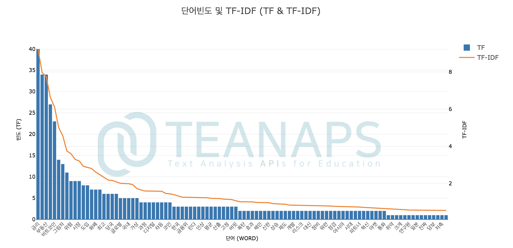

- `teanaps.text_analysis.TfidfCalculator.get_wordcloud(weight_dict)` [[Top]](#teanaps-architecture)
  - 단어의 TF, TF-IDF 값을 표현한 워드클라우드를 반환합니다.
  - Parameters
    - *weight_dict (dict) : TF, TF-IDF 값을 저장한 딕셔너리. `teanaps.text_analysis.TfidfCalculator.get_tf_dict()`, `teanaps.text_analysis.TfidfCalculator.get_tfidf_dict()` 참고.*
  - Returns
    - *figure (matplotlib.pyplot.plt) : 워드클리우드.*
  - Examples

    > Python Code (in Jupyter Notebook) :
    > ```python
    > #tfidf.calculation_tfidf(tokenized_sentence_list)
    > result = tfidf.get_tfidf_dict()
    > #result = tfidf.get_tfidf_dict()
    > tfidf.get_wordcloud(result)
    > ```
    > Output (in Jupyter Notebook) :
    > 

##### 3.2. `teanaps.text_analysis.DocumentClustering`

> Python Code (in Jupyter Notebook) :
> ```python
> from teanaps.text_analysis import DocumentClustering
>
> dc = DocumentClustering()
> ```

- `teanaps.text_analysis.DocumentClustering.clustering(alg, document_list, num_cluters=3, max_iterations=300, eps=0.5, min_samples=5)` [[Top]](#teanaps-architecture)
  - 문서를 군집화하여 그 결과를 반환합니다.
  - Parameters
    - *alg (str) : 클러스터링 알고리즘. {"kmeans", "dbscan", "hdbscan"} 중 하나.*
    - *document_list (list) : 형태소 단위로 분리된 단어로 표현된 문서를 포함하는 리스트.*
    - *num_cluters (int) : 생성할 군집의 개수.*
    - *max_iterations (int) : 군집화를 반복해서 수행할 횟수.*
    - *eps (float) : DBSCAN 알고리즘 하이퍼파라미터.*
    - *min_samples (int) : 클러스터에 포함할 최소 데이터 개수.*
  - Returns
    - *result (dict) : 군집의 Inertia 값과 문서별 군집 레이블을 포함하는 딕셔너리.*
  - Examples

    > Python Code (in Jupyter Notebook) :
    > ```python
    > result = dc.clustering("kmeans", document_list, num_cluters=3, max_iterations=300)
    > print(result)
    > ```
    > Output (in Jupyter Notebook) :
    > ```python
    > {'inertia': 64.11752014008104,
    >  'predict_list': array([0, 0, 0, 0, 0, 0, 0, 0, 0, 0, 0, 0, 0, 0, 0, 0, 0, 0, 0, 0, 0, 0, 0, 0, 0, 0, 0, 0, 0, 0, 0, 0, 0, 0, 1, 1, 1, 1, 1, 1, 1, 1, 1, 1, 0, 1, 1, 1, 1, 1, 1, 1, 1, 1, 1, 1, 1, 1, 1, 1, 1, 1, 1, 1, 1, 1, 1, 2, 2, 2, 2, 2, 2, 2, 2, 2, 2, 2, 2, 2, 2, 2, 2, 2, 2, 2, 2, 2, 2, 2, 2, 2, 2, 2, 2, 2, 2, 2, 2, 2], dtype=int32)}
    > ```

    > Python Code (in Jupyter Notebook) :
    > ```python
    > result = dc.clustering("dbscan", document_list, eps=0.5, min_samples=5)
    > print(result)
    > ```
    > Output (in Jupyter Notebook) :
    > ```python
    > {'inertia': 64.11752014008104,
    >  'predict_list': array([-1, -1, 0, 0, 0, 0, 0, 0, 0, 0, 0, -1, 0, 0, 0, 0, 0, 0, 0, 0, 0, 0, 0, 0, 0, 0, 0, 0, 0, 0, 0, 0, 0, 0, 1, 1, 1, 1, 1, 1, 1, 1, 1, 1, 0, 1, -1, 1, 1, 1, 1, 1, -1, -1, 1, -1, 1, 1, 1, 1, 1, 1, 1, 1, 1, 1, 1, 2, 2, 2, 2, 2, 2, 2, 2, 2, 2, 2, 2, 2, 2, -1, -1, 2, 2, 2, 2, 2, 2, 2, 2, 2, 2, 2, 2, 2, 2, 2, 2, 2], dtype=int32)}
    > ```

    > Python Code (in Jupyter Notebook) :
    > ```python
    > result = dc.clustering("hdbscan", document_list, min_samples=5)
    > print(result)
    > ```
    > Output (in Jupyter Notebook) :
    > ```python
    > {'inertia': 64.11752014008104,
    >  'predict_list': array([-1, -1, 0, 0, 0, 0, 0, 0, 0, 0, 0, -1, 0, 0, 0, 0, 0, 0, 0, 0, 0, 0, 0, 0, 0, 0, 0, 0, 0, 0, 0, 0, 0, 0, 1, 1, 1, 1, 1, 1, 1, 1, 1, 1, 0, 1, -1, 1, 1, 1, 1, 1, -1, -1, 1, -1, 1, 1, 1, 1, 1, 1, 1, 1, 1, 1, 1, 2, 2, 2, 2, 2, 2, 2, 2, 2, 2, 2, 2, 2, 2, -1, -1, 2, 2, 2, 2, 2, 2, 2, 2, 2, 2, 2, 2, 2, 2, 2, 2, 2], dtype=int32)}
    > ```

- `teanaps.text_analysis.DocumentClustering.kmeans_inertia_transition(document_list, max_cluters, max_iterations)` [[Top]](#teanaps-architecture)
  - K-MEANS 알고리즘의 군집 개수를 변경하며 문서를 군집화하고 각각의 Inertial 값을 반환합니다.
  - Parameters
    - *document_list (list) : 형태소 단위로 분리된 단어로 표현된 문서를 포함하는 리스트.*
    - *max_cluters (int) : Intertia 값을 계산할 최대 군집의 개수.*
    - *max_iterations (int) : 군집화를 반복해서 수행할 횟수.*
  - Returns
    - *result (dict) : 군집의 Inertia 값과 문서별 군집 레이블을 포함하는 딕셔너리.*
  - Examples

    > Python Code (in Jupyter Notebook) :
    > ```python
    > result = dc.inertia_transition(tokenized_sentence_list, 10, 300)
    > print(result)
    > ```
    > Output (in Jupyter Notebook) :
    > ```python
    > [85.29314909321171, 73.22892942068657, 64.11752014008104, 60.672117244161946, 57.24561408281322, 55.125181445741525, 53.74440369290694, 52.262356865901175, 50.26148838373041, 48.480517037436805]
    > ```

- `teanaps.text_analysis.DocumentClustering.get_kmeans_inertia_transition_graph(inertia_list)` [[Top]](#teanaps-architecture)
  - 각각의 Inertial 값을 표현한 그래프를 반환합니다.
  - Parameters
    - *inertia_list (list) : Inertial 값이 포함된 리스트.*
  - Returns
    - *plotly graph (graph object) : 각각의 군집의 개수별 Inertial 그래프.*
  - Examples

    > Python Code (in Jupyter Notebook) :
    > ```python
    > inertia_list = dc.inertia_transition(tokenized_sentence_list, 10, 300)
    > dc.get_inertia_transition_graph(inertia_list)
    > ```
    > Output (in Jupyter Notebook) :
    > 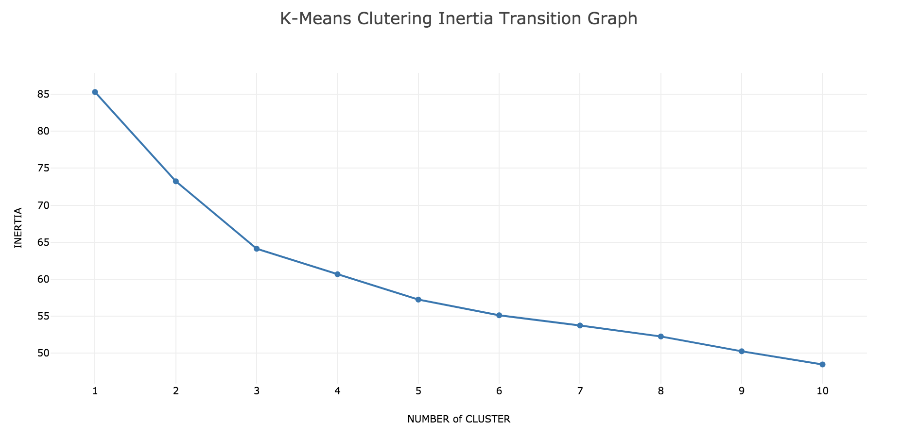

- `teanaps.text_analysis.DocumentClustering.get_tfidf_tsne(document_list, predict_list, df_article)` [[Top]](#teanaps-architecture)
  - 각 문서의 레이블과 군집, 그리고 문서를 TF-IDF 임베딩하여 차원축소한 2차원 좌표를 포함하는 DataFrame을 반환합니다.
  - Parameters
    - *document_list (str) : 형태소 단위로 분리된 단어로 표현된 문서를 포함하는 리스트.*
    - *predict_list (str) : 군집화 결과 레이블을 포함하는 리스트.*
    - *df_article (str) : 문서와 레이블을 포함하는 DataFrame.*
  - Returns
    - *Pandas DataFrame (dataframe) : 각 문서의 레이블과 군집, 그리고 문서를 TF-IDF 임베딩하여 차원축소한 2차원 좌표를 포함하는 DataFrame.*
  - Examples

    > Python Code (in Jupyter Notebook) :
    > ```python
    > import pandas as pd
    > clustering_result = dc.kmeans_clustering(document_list, 3, 300)
    > predict_list  = clustering_result["predict_list"]
    > df_article = pd.DataFrame(document_list, columns = ["label", "source", "datetime", "title", "content"])
    > result = dc.get_tfidf_tsne(document_list, predict_list, df_article)
    > print(type(result))
    > ```
    > Output (in Jupyter Notebook) :
    > ```python
    > pandas.core.frame.DataFrame
    > ```

- `teanaps.text_analysis.DocumentClustering.get_cluster_graph(df_tfidf_tsne, label_type)` [[Top]](#teanaps-architecture)
  - 군집화 결과를 2차원으로 표현한 그래프를 반환합니다.
  - Parameters
    - *df_tfidf_tsne (DataFrame) : 각 문서의 레이블과 군집, 그리고 문서를 TF-IDF 임베딩하여 차원축소한 2차원 좌표를 포함하는 DataFrame.*
    - *label_type (str) : 그래프에 표시할 레이블 유형. {"predict", "labe"} 중 하나.*
  - Returns
    - *plotly graph (graph object) : 군집화 결과 그래프.*
  - Examples

    > Python Code (in Jupyter Notebook) :
    > ```python
    > dc.get_kmeans_graph(df_result, "predict")
    > ```
    > Output (in Jupyter Notebook) :
    > 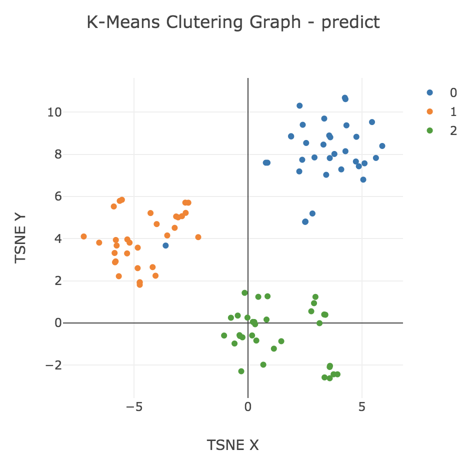

    > Python Code (in Jupyter Notebook) :
    > ```python
    > dc.get_kmeans_graph(df_result, "label")
    > ```
    > Output (in Jupyter Notebook) :
    > 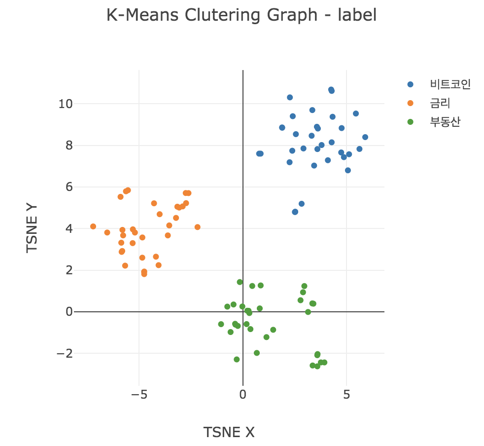

- `teanaps.text_analysis.DocumentClustering.get_silhouette_score2(alg, document_list, df_tfidf_tsne,  num_clusters=3, eps=0.5, min_samples=5)` [[Top]](#teanaps-architecture)
  - 군집화 결과에 대한 실루엣 스코어를 계산하고 그 결과를 반환합니다.
  - Parameters
    - *document_list (list) : 형태소 단위로 분리된 단어로 표현된 문서를 포함하는 리스트.*
    - *df_tfidf_tsne (DataFrame) : 각 문서의 레이블과 군집, 그리고 문서를 TF-IDF 임베딩하여 차원축소한 2차원 좌표를 포함하는 DataFrame.*
    - *num_cluters (int) : 생성할 군집의 개수.*
    - *eps (float) : DBSCAN 알고리즘 하이퍼파라미터.*
    - *min_samples (int) : 클러스터에 포함할 최소 데이터 개수.*
  - Returns
    - *result (float) : 군집화 결과에 대한 실루엣 스코어.*
  - Examples

    > Python Code (in Jupyter Notebook) :
    > ```python
    > result = dc.get_silhouette_score2("kmeans", document_list, df_tfidf_tsne, num_clusters=3)
    > print(result)
    > ```
    > Output (in Jupyter Notebook) :
    > ```python
    > 0.1772473694643886
    > ```

- `teanaps.text_analysis.DocumentClustering.get_silhouette_graph2(alg, document_list, df_result, num_clusters=3, eps=0.5, min_samples=5)` [[Top]](#teanaps-architecture)
  - 군집화 결과에 대한 실루엣 그래프를 반환합니다.
  - Parameters
    - *document_list (str) : 형태소 단위로 분리된 단어로 표현된 문서를 포함하는 리스트.*
    - *df_tfidf_tsne (DataFrame) : 각 문서의 레이블과 군집, 그리고 문서를 TF-IDF 임베딩하여 차원축소한 2차원 좌표를 포함하는 DataFrame.*
    - *num_cluters (int) : 생성할 군집의 개수.*
  - Returns
    - *plotly graph (graph object) : 군집화 결과와 실루엣 그래프.*
  - Examples

    > Python Code (in Jupyter Notebook) :
    > ```python
    > dc.get_silhouette_graph2("kmeans", document_list, df_tfidf_tsne, num_clusters=3)
    > ```
    > Output (in Jupyter Notebook) :
    > 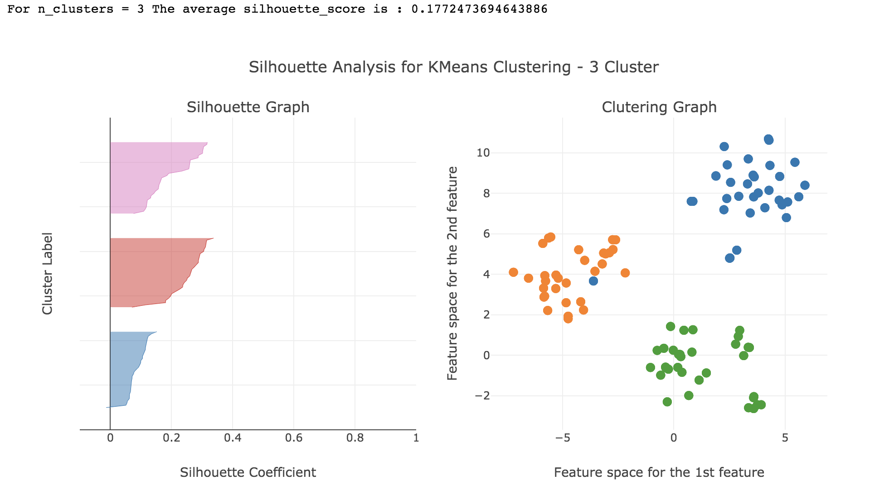

- `teanaps.text_analysis.DocumentClustering.get_pair_wize_matrix(document_list)` [[Top]](#teanaps-architecture)
  - 각 문서간의 유사도를 매트릭스로 표현한 그래프를 반환합니다.
  - Parameters
    - *document_list (str) : 형태소 단위로 분리된 단어로 표현된 문서를 포함하는 리스트.*
  - Returns
    - *plotly graph (graph object) : 각 문서간의 유사도를 매트릭스로 표현한 그래프.*
  - Examples

    > Python Code (in Jupyter Notebook) :
    > ```python
    > dc.get_pair_wize_matrix(document_list)
    > ```
    > Output (in Jupyter Notebook) :
    > 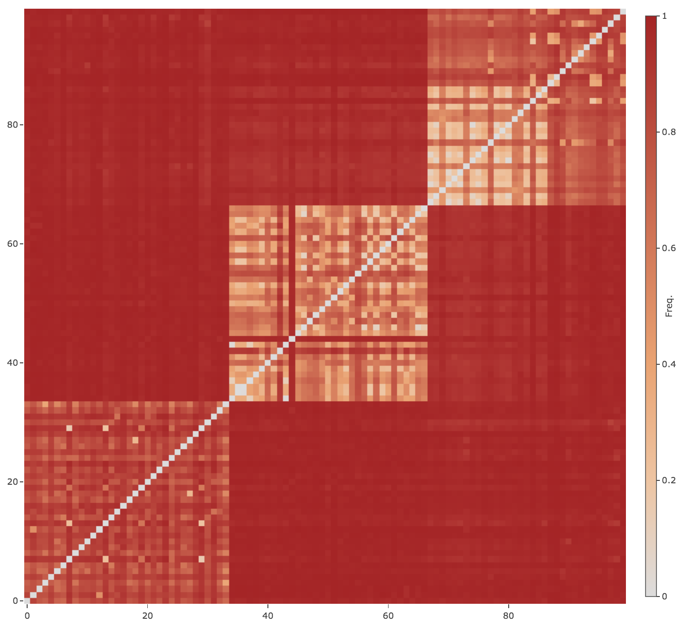

- `teanaps.text_analysis.DocumentClustering.get_dendrogram_graph(document_list)` [[Top]](#teanaps-architecture)
  - 각 문서간의 유사도를 덴도그램으로 표현한 그래프를 반환합니다.
  - Parameters
    - *document_list (str) : 형태소 단위로 분리된 단어로 표현된 문서를 포함하는 리스트.*
  - Returns
    - *plotly graph (graph object) : 각 문서간의 유사도를 덴도그램으로 표현한 그래프.*
  - Examples

    > Python Code (in Jupyter Notebook) :
    > ```python
    > dc.get_dendrogram_graph(document_list)
    > ```
    > Output (in Jupyter Notebook) :
    > 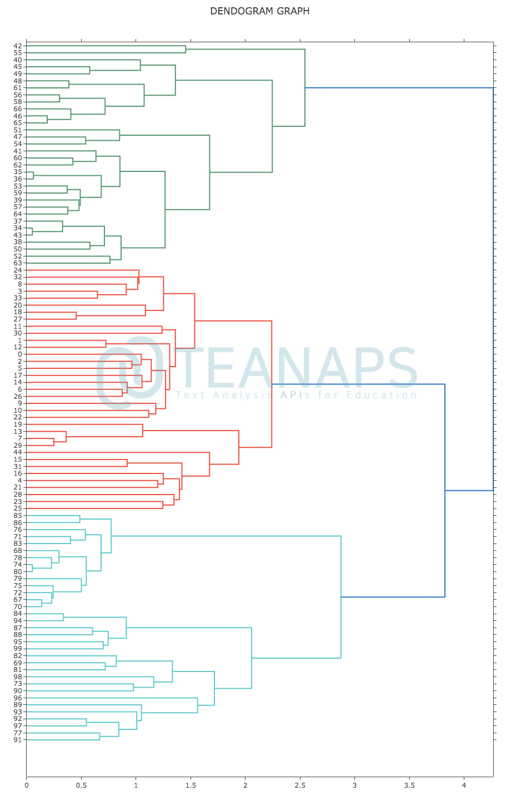

##### 3.3. `teanaps.text_analysis.TopicClustering`

> Python Code (in Jupyter Notebook) :
> ```python
> from teanaps.text_analysis import TopicClustering
>
> tc = TopicClustering()
> ```

- `teanaps.text_analysis.TopicClustering.topic_modeling(modeling_type, document_list, topic_count, keyword_count)` [[Top]](#teanaps-architecture)
  - 문서에서 N개의 주제에 대해 각 군집별 키워드를 군집화하고 그 결과를 반환합니다.
  - Parameters
    - *modeling_type (str) : 주제 군집화 알고리즘 유형. {"lsa", "lda", "hdp"} 중 하나.*
    - *document_list (list) : 형태소 단위로 분리된 단어로 표현된 문서를 포함하는 리스트.*
    - *topic_count (int) : 주제 군집 개수.*
    - *keyword_count (int) : 각 주제 군집별 키워드 개수.*
  - Returns
    - *result (list) : 각 군집별 키워드를 포함하는 리스트.*
  - Examples

    > Python Code (in Jupyter Notebook) :
    > ```python
    > result = tc.topic_modeling("lda", document_list, 3, 5)
    > print(result)
    > ```
    > Output (in Jupyter Notebook) :
    > ```python
    > [(0,
    >  [('금리', 0.6542361201136048),
    >   ('대출', 0.4330323607960353),
    >   ('금융', 0.3083228589169829),
    >   ('은행', 0.22088983702295698),
    >   ('코픽스', 0.173373240489713)]),
    > (1,
    >  [('비트코인', 0.6987330564487386),
    >   ('금리', -0.25924223777122957),
    >   ('화폐', 0.218391247175097),
    >   ('금융', 0.20393479642923928),
    >   ('암호', 0.18284477353567058)]),
    > (2,
    >  [('부동산', -0.6584326085475736),
    >   ('금융', -0.40842310832729234),
    >   ('비트코인', 0.36212229767170806),
    >   ('금리', 0.19995317435138174),
    >   ('신탁', -0.18356626669622753)])
    > ]
    > ```

- `teanaps.text_analysis.TopicClustering.get_model_validation_result()` [[Top]](#teanaps-architecture)
  - 주제 군집화 결과에 대해 Perplexity, Coherence 값을 계산하고 그 결과를 반환합니다.
  - Parameters
    - *None*
  - Returns
    - *result (tuple) : 주제 군집의 Perplexity, Coherence 값을 저장한 Tuple.*
  - Examples

    > Python Code (in Jupyter Notebook) :
    > ```python
    > #result = tc.topic_modeling("lda", document_list, 3, 5)
    > perplexity, coherence = tc.get_model_validation_result()
    > print(perplexity)
    > print(coherence)
    > ```
    > Output (in Jupyter Notebook) :
    > ```python
    > -6.633342221630287
    > 0.5127122691849578
    > ```

- `teanaps.text_analysis.TopicClustering.display_model_result()` [[Top]](#teanaps-architecture)
  - 주제 군집화 결과를 시각화하여 표현합니다.
  - Parameters
    - *None*
  - Returns
    - *result (IPython.core.display.HTML) : 주제 군집 시각화 결과.*
  - Examples

    > Python Code (in Jupyter Notebook) :
    > ```python
    > #result = tc.topic_modeling("lda", document_list, 3, 5)
    > tc.display_model_result()
    > ```
    > Output (in Jupyter Notebook) :
    > 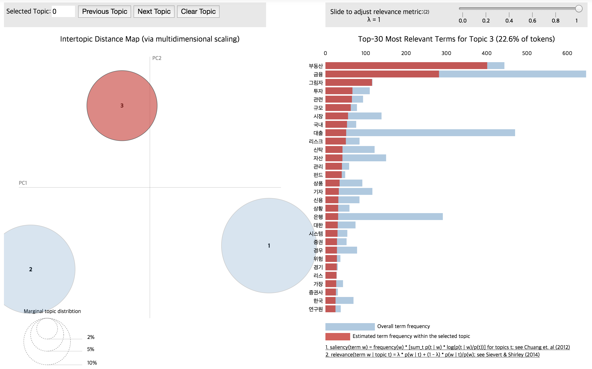

- `teanaps.text_analysis.TopicClustering.get_topics_sentences(document_list)` [[Top]](#teanaps-architecture)
  - 주제 군집화 결과에 대해 각 주제에 해당하는 문서를 찾아내고 그 결과를 반환합니다.
  - Parameters
    - *document_list (str) : 형태소 단위로 분리된 단어로 표현된 문서를 포함하는 리스트.*
  - Returns
    - *Pandas DataFrame (dataframe) : 각 주제에 해당하는 문서를 포함하는 DataFrame.*
  - Examples

    > Python Code (in Jupyter Notebook) :
    > ```python
    > #result = tc.topic_modeling("lda", document_list, 3, 5)
    > result = tc.get_topics_sentences(document_list)
    > print(type(result))
    > ```
    > Output (in Jupyter Notebook) :
    > ```python
    > pandas.core.frame.DataFrame
    > ```

- `teanaps.text_analysis.TopicClustering.get_model_validation_graph(modeling_type, document_list, max_topic_count)` [[Top]](#teanaps-architecture)
  - 주제의 개수별 주제 군집화 결과에 대해 Perplexity, Coherence 값을 계산하고 그 결과를 라인그래프로 표현합니다.
  - Parameters
    - *modeling_type (str) : 주제 군집화 알고리즘 유형. {"lsa", "lda", "hdp"} 중 하나.*
    - *document_list (list) : 형태소 단위로 분리된 단어로 표현된 문서를 포함하는 리스트.*
    - *max_topic_count (int) : 최대 주제 군집 개수.*
  - Returns
    - *plotly graph (graph object) : 각 주제 군집별 Perplexity, Coherence 값을 표현한 라인그래프.*
  - Examples

    > Python Code (in Jupyter Notebook) :
    > ```python
    > result = tc.get_model_validation_graph("lda", document_list, 10)
    > print(type(result))
    > ```
    > Output (in Jupyter Notebook) :
    > 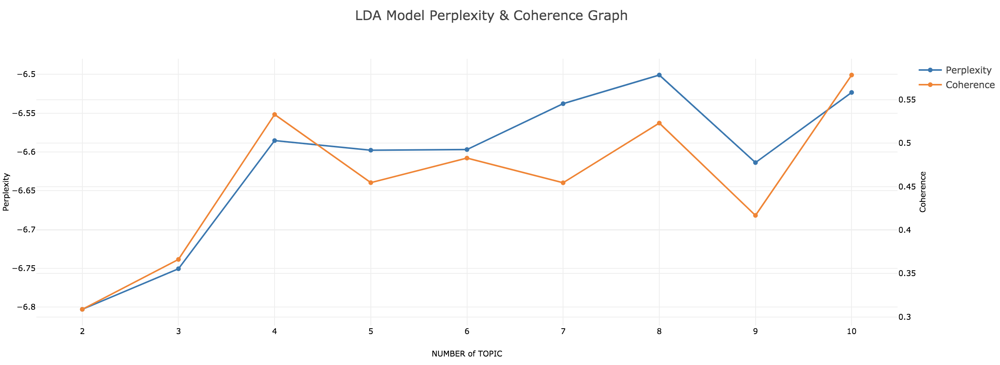

- `teanaps.text_analysis.sequence_lda_topic_modeling(document_list, time_slice, topic_count)` [[Top]](#teanaps-architecture)
  - 문서에서 N개의 주제에 대해 각 군집의 기간별 변화 추이를 계산하고 그 결과를 반환합니다.
  - Parameters
    - *document_list (list) : 형태소 단위로 분리된 단어로 표현된 문서를 포함하는 리스트.*
    - *time_slice (list) : 전체 문서를 기간으로 구분하는 단위*
    - *topic_count (int) : 주제 군집 개수.*
  - Returns
    - *result (list) : 각 기간/군집별 키워드를 포함하는 리스트.*
  - Examples

    > Python Code (in Jupyter Notebook) :
    > ```python
    > result = tc.sequence_lda_topic_modeling(document_list, [100, 100, ..., 100]], 5)
    > print(result)
    > ```
    > Output (in Jupyter Notebook) :
    > ```python
    > [(0,
    >  [[('주식', 0.021218330732594246),
    >    ('종목', 0.018796542321031225),
    >    ('시장', 0.01679681367262934),
    >    ...],
    >   [('주식', 0.02193776754354376),
    >    ('종목', 0.01936867384889522),
    >    ('시장', 0.016617304727897478),
    >    ...,
    >   ],
    >   ...,
    >  ],
    >  ...,
    > ]
    > ```

- `teanaps.text_analysis.get_sequence_topic_graph()` [[Top]](#teanaps-architecture)
  - 문서에서 N개의 주제에 대해 각 군집의 기간별 변화 추이를 계산하고 이를 그래프로 표현합니다.
  - Parameters
    - *None*
  - Returns
    - *plotly graph (graph object) : 군집의 기간별 변화 추이를 표한한 라인그래프.*
  - Examples

    > Python Code (in Jupyter Notebook) :
    > ```python
    > tc.get_sequence_topic_graph()
    > ```
    > Output (in Jupyter Notebook) :
    > 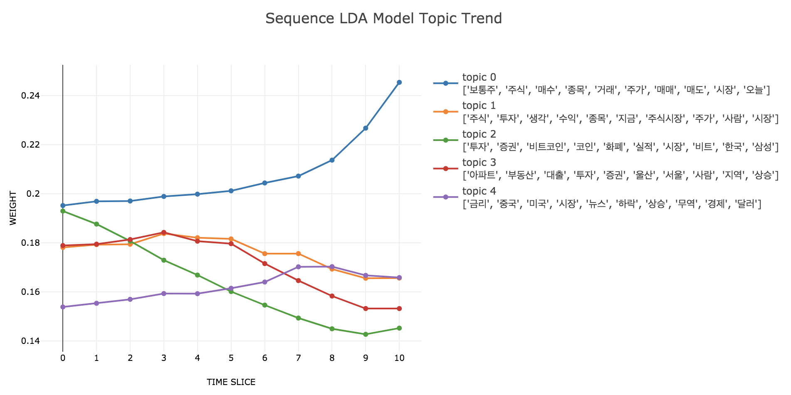

##### 3.4. `teanaps.text_analysis.CoWordCalculator`

> Python Code (in Jupyter Notebook) :
> ```python
> from teanaps.text_analysis import CoWordCalculator
>
> co = CoWordCalculator()
> ```

- `teanaps.text_analysis.CoWordCalculator.calculation_co_matrix(document_list, node_list=[])` [[Top]](#teanaps-architecture)
  - 문서에 포함된 단어의 동시출현빈도를 계산합니다.
  - Parameters
    - *document_list (list) : 형태소 단위로 분리된 단어로 표현된 문서를 포함하는 리스트.*
    - *node_list (list) : 동시출현빈도를 계산할 단어 리스트.*
  - Returns
    - *None*
  - Examples

    > Python Code (in Jupyter Notebook) :
    > ```python
    > node_list = ["금리", "금융", "대출", "비트코인", "부동산", "은행", "코픽스", "자산", "시장", "신탁", "그림자", "투자", "거래", "정부", "상품", "신용", "리스크"]
    > co.calculation_co_matrix(document_list, node_list=node_list)
    > ```

- `teanaps.text_analysis.CoWordCalculator.get_edge_list()` [[Top]](#teanaps-architecture)
  - 문서에 포함된 단어의 동시출현 순서쌍과 출현빈도를 반환합니다.
  - Parameters
    - *None*
  - Returns
    - *result (list) : ((단어, 단어), 동시출현빈도) 구조의 Tuple을 포함하는 리스트.*
  - Examples

    > Python Code (in Jupyter Notebook) :
    > ```python
    > #node_list = ["금리", "금융", "대출", "비트코인", "부동산", "은행", "코픽스", "자산", "시장", "신탁", "그림자", "투자", "거래", "정부", "상품", "신용", "리스크"]
    > #co.calculation_co_matrix(document_list, node_list=node_list)
    > result = co.get_edge_list()
    > print(result)
    > ```
    > Output (in Jupyter Notebook) :
    > ```python
    > [(('금리', '금리'), 905),
    >  (('금융', '금융'), 791),
    >  (('대출', '대출'), 580),
    >  (('비트코인', '비트코인'), 565),
    >  (('부동산', '부동산'), 555),
    >  ...,
    >  (('대출', '신탁'), 1),
    >  (('금리', '자산'), 1),
    >  (('자산', '금리'), 1),
    >  (('신탁', '투자'), 1),
    >  (('투자', '신탁'), 1)
    > ]
    > ```

- `teanaps.text_analysis.CoWordCalculator.get_node_list()` [[Top]](#teanaps-architecture)
  - 동시출현빈도 계산에 포함된 모든 단어를 반환합니다.
  - Parameters
    - *None*
  - Returns
    - *result (list) : 동시출현빈도 계산에 포함된 모든 단어 리스트.*
  - Examples

    > Python Code (in Jupyter Notebook) :
    > ```python
    > #node_list = ["금리", "금융", "대출", "비트코인", "부동산", "은행", "코픽스", "자산", "시장", "신탁", "그림자", "투자", "거래", "정부", "상품", "신용", "리스크"]
    > #co.calculation_co_matrix(document_list, node_list=node_list)
    > result = co.get_node_list()
    > print(result)
    > ```
    > Output (in Jupyter Notebook) :
    > ```python
    > ['금리', '금융', '대출', '비트코인', '부동산', '은행', '코픽스', '자산', '시장', '신탁', '그림자', '투자', '거래', '정부', '상품', '신용', '리스크']
    > ```

- `teanaps.text_analysis.CoWordCalculator.get_co_word(word)` [[Top]](#teanaps-architecture)
  - 특정 단어를 기준으로 다른 단어들과의 동시출현빈도를 반환합니다.
  - Parameters
    - *word (str) : 동시출현빈도를 계산할 때 기준이 되는 단어.*
  - Returns
    - *result (list) : (단어, 동시출현빈도) 구조의 Tuple을 포함하는 리스트.*
  - Examples

    > Python Code (in Jupyter Notebook) :
    > ```python
    > #node_list = ["금리", "금융", "대출", "비트코인", "부동산", "은행", "코픽스", "자산", "시장", "신탁", "그림자", "투자", "거래", "정부", "상품", "신용", "리스크"]
    > #co.calculation_co_matrix(document_list, node_list=node_list)
    > result = co.get_co_word("금리")
    > print(result)
    > ```
    > Output (in Jupyter Notebook) :
    > ```python
    > [('대출', 341),
    >  ('코픽스', 105),
    >  ('은행', 82),
    >  ...,
    >  ('정부', 2),
    >  ('비트코인', 1),
    >  ('자산', 1)
    > ]
    > ```

- `teanaps.text_analysis.CoWordCalculator.get_centrality(centrality_type)` [[Top]](#teanaps-architecture)
  - 단어의 동시출현 정보를 바탕으로 네트워크 중심성을 계산하고 그 결과를 반환합니다.
  - Parameters
    - *centrality_type (str) : 네트워크 중심성 유형. {"d_cent", "b_cent", "c_cent"} 중 하나.*
  - Returns
    - *result (dict) : 단어와 단어의 중심성을 포함하는 딕셔너리.*
  - Examples

    > Python Code (in Jupyter Notebook) :
    > ```python
    > #node_list = ["금리", "금융", "대출", "비트코인", "부동산", "은행", "코픽스", "자산", "시장", "신탁", "그림자", "투자", "거래", "정부", "상품", "신용", "리스크"]
    > #co.calculation_co_matrix(document_list, node_list=node_list)
    > result = co.get_centrality("d_cent")
    > print(result)
    > ```
    > Output (in Jupyter Notebook) :
    > ```python
    > {'거래': 0.625,
    >  '그림자': 0.5625,
    >  '금리': 0.9375,
    >  ...,
    >  '정부': 0.75,
    >  '코픽스': 0.5625,
    >  '투자': 0.625
    > }
    > ```

- `teanaps.text_analysis.CoWordCalculator.get_co_matrix_graph(max_count)` [[Top]](#teanaps-architecture)
  - 단어의 동시출현빈도 상위 N개를 매트릭스 그래프로 표현합니다.
  - Parameters
    - *max_count (int) : 매트릭스 그래프로 표현할 단어의 개수.*
  - Returns
    - *plotly graph (graph object) : 동시출현빈도를 표현한 매트릭스 그래프.*
  - Examples

    > Python Code (in Jupyter Notebook) :
    > ```python
    > #node_list = ["금리", "금융", "대출", "비트코인", "부동산", "은행", "코픽스", "자산", "시장", "신탁", "그림자", "투자", "거래", "정부", "상품", "신용", "리스크"]
    > #co.calculation_co_matrix(document_list, node_list=node_list)
    > co.get_co_matrix_graph(max_count)
    > ```
    > Output (in Jupyter Notebook) :
    > 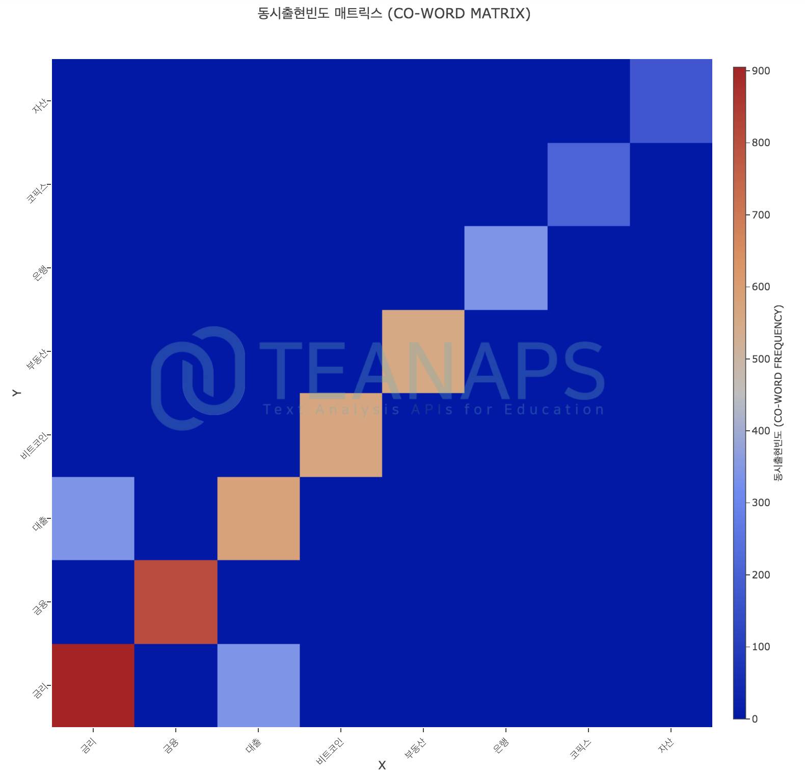

- `teanaps.text_analysis.CoWordCalculator.get_word_network_graph(centrality_dict)` [[Top]](#teanaps-architecture)
  - 단어의 동시출현 관계를 네트워크 그래프로 표현합니다.
  - Parameters
    - *centrality_dict (dict) : 단어와 단어의 중심성을 포함하는 딕셔너리. `teanaps.text_analysis.CoWordCalculator.get_centrality`참고.*
  - Returns
    - *plotly graph (graph object) : 동시출현빈도를 표현한 네트워크 그래프.*
  - Examples

    > Python Code (in Jupyter Notebook) :
    > ```python
    > #node_list = ["금리", "금융", "대출", "비트코인", "부동산", "은행", "코픽스", "자산", "시장", "신탁", "그림자", "투자", "거래", "정부", "상품", "신용", "리스크"]
    > #co.calculation_co_matrix(document_list, node_list=node_list)
    > co.get_co_matrix_graph(max_count)
    > ```
    > Output (in Jupyter Notebook) :
    > 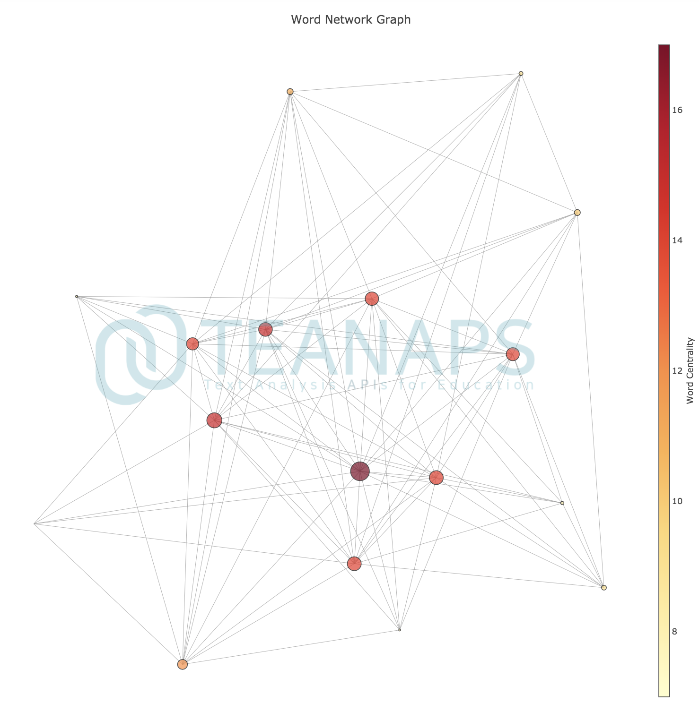

##### 3.5. `teanaps.text_analysis.SentimentAnalysis`

> Python Code (in Jupyter Notebook) :
> ```python
> from teanaps.text_analysis import SentimentAnalysis
>
> senti = SentimentAnalysis(model_path="/model", kobert_path="/kobert")
> ```

> Notes :  
> - 모델과 KoBERT 파일을 별도로 다운로드([모델](https://drive.google.com/file/d/11zkNQ0i9MUlqWVG_y7Ynrpt1yv5jabsx/view?usp=sharing)/[KoBERT](https://drive.google.com/file/d/11RBCiWkNblT26qAASvYTA4MmkwuE5gGe/view?usp=sharing))하여 파일 경로를 각각 `model_path`, `kobert_path` 변수에 포함해야합니다.

- `teanaps.text_analysis.SentimentAnalysis.tag(sentence, neutral_th=0.5)` [[Top]](#teanaps-architecture)
  - 문장의 감성수준을 긍정 또는 부정으로 분류하고 그 결과를 반환합니다.
  - Parameters
    - *sentence (str) : 한국어 또는 영어로 구성된 문장. 최대 128자.*
    - *neutral_th (float) : 긍정 또는 부정의 강도 차이에서 중립으로 판단하는 범위. 0~1.*
  - Returns
    - *result (list) : ((부정 강도, 긍정 강도), 긍/부정 라벨) 구조의 Tuple을 포함하는 리스트. 긍정/부정 강도는 0~1. 긍부정 라벨은 {"positive", "negative"} 중 하나.*
  - Examples

    > Python Code (in Jupyter Notebook) :
    > ```python
    > sentence = "늘 배우고 배푸는 자세가 필요합니다."
    > result = senti.tag(sentence, neutral_th=0.3)
    > print(result)
    > ```
    > Output (in Jupyter Notebook) :
    > ```python
    > ((0.0595, 0.9543), 'positive')
    > ```

    > Python Code (in Jupyter Notebook) :
    > ```python
    > sentence = "과한 욕심은 주변 사람들에게 피해를 줍니다."
    > result = senti.tag(sentence, neutral_th=0.3)
    > print(result)
    > ```
    > Output (in Jupyter Notebook) :
    > ```python
    > ((0.8715, 0.1076), 'negative')
    > ```

- `teanaps.text_analysis.SentimentAnalysis.get_weight(sentence)` [[Top]](#teanaps-architecture)
  - 감성수준 분류에 참조된 각 각 형태소별 가중치를 하이라이트한 형태의 문장 그래프로 출력합니다.
  - Parameters
    - *sentence (str) : 한국어 또는 영어로 구성된 문장. 최대 128자.*
  - Returns
    - *token_list (list) : 문장의 각 형태소를 포함하는 리스트.*
    - *weight_list (list) : 문장의 각 형태소 별 가중치를 포함하는 리스트.*
  - Examples

    > Python Code (in Jupyter Notebook) :
    > ```python
    > sentence = "늘 배우고 배푸는 자세가 필요합니다."
    > token_list, weight_list = senti.get_weight(sentence)
    > print(token_list)
    > print(weight_list)
    > ```
    > Output (in Jupyter Notebook) :
    > ```python
    > [' 늘', ' 배우', '고', ' 배', '푸', '는', ' 자세', '가', ' 필요', '합니다', ' ', '.']
    > [0.072522074, 0.08697342, 0.052703843, 0.051040735, 0.0606895, 0.05134341, 0.05213573, 0.08644837, 0.078125894, 0.079360135, 0, 0.079488374]
    > ```

    > Python Code (in Jupyter Notebook) :
    > ```python
    > sentence = "과한 욕심은 주변 사람들에게 피해를 줍니다."
    > token_list, weight_list = senti.get_weight(sentence)
    > print(token_list)
    > print(weight_list)
    > ```
    > Output (in Jupyter Notebook) :
    > ```python
    > [' ', '과', '한', ' 욕심', '은', ' 주변', ' 사람들', '에게', ' 피해를', ' ', '줍', '니다', ' ', '.']
    > [0, 0.020344315, 0.024879746, 0.02612342, 0.03615231, 0.048542265, 0.06707654, 0.0936653, 0.07649707, 0, 0.08189902, 0.08962273, 0, 0.07841993]
    > ```

- `teanaps.text_analysis.SentimentAnalysis.draw_weight(sentence)` [[Top]](#teanaps-architecture)
  - 감성수준 분류에 참조된 각 각 형태소별 가중치를 히스토그램으로 출력합니다.
  - Parameters
    - *sentence (str) : 한국어 또는 영어로 구성된 문장. 최대 128자.*
  - Returns
    - *plotly graph (graph object) : 감성수준 분류에 참조된 각 각 형태소에 대한 가중치 그래프.*
  - Examples

    > Python Code (in Jupyter Notebook) :
    > ```python
    > sentence = "늘 배우고 배푸는 자세가 필요합니다."
    > senti.draw_weight(sentence)
    > ```
    > Output (in Jupyter Notebook) :
    > 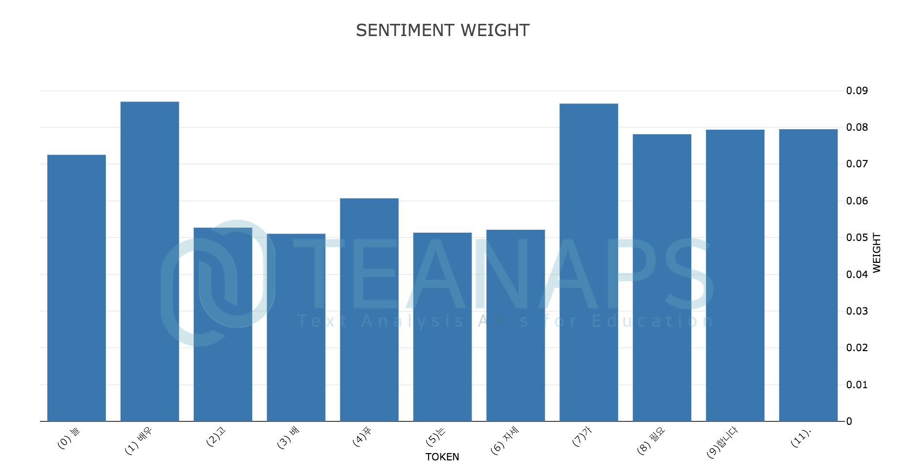

    > Python Code (in Jupyter Notebook) :
    > ```python
    > sentence = "과한 욕심은 주변 사람들에게 피해를 줍니다."
    > senti.draw_weight(sentence)
    > ```
    > Output (in Jupyter Notebook) :
    > 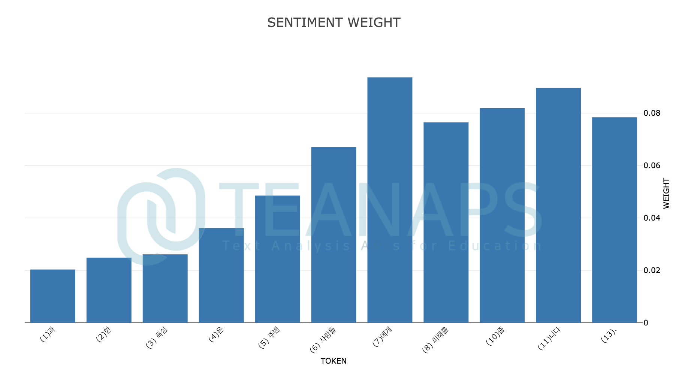

- `teanaps.text_analysis.SentimentAnalysis.draw_sentence_weight(sentence)` [[Top]](#teanaps-architecture)
  - 감성수준 분류에 참조된 각 각 형태소별 가중치를 하이라이트한 형태의 문장 그래프로 출력합니다.
  - Parameters
    - *sentence (str) : 한국어 또는 영어로 구성된 문장. 최대 128자.*
  - Returns
    - *plotly graph (graph object) : 문장 그래프.*
  - Examples

    > Python Code (in Jupyter Notebook) :
    > ```python
    > sentence = "늘 배우고 배푸는 자세가 필요합니다."
    > senti.draw_sentence_weight(sentence)
    > ```
    > Output (in Jupyter Notebook) :
    > 

    > Python Code (in Jupyter Notebook) :
    > ```python
    > sentence = "과한 욕심은 주변 사람들에게 피해를 줍니다."
    > senti.draw_sentence_weight(sentence)
    > ```
    > Output (in Jupyter Notebook) :
    > 

- `teanaps.text_analysis.SentimentAnalysis.get_sentiment_parse(sentence, neutral_th=0.3, , tagger="mecab", model_path="/model")` [[Top]](#teanaps-architecture)
  - 문장의 각 어절에 대한 감성수준을 긍정 또는 부정으로 분류하고 그 가중치를 반환합니다.
  - Parameters
    - *sentence (str) : 한국어 또는 영어로 구성된 문장. 최대 128자.*
    - *neutral_th (float) : 긍정 또는 부정의 강도 차이에서 중립으로 판단하는 범위. 0~1.*
    - *tagger (str) : 형태소 분석기 {"okt", "mecab", "mecab-ko", "kkma"} 중 하나 입력. `teanaps.nlp.ma.set_tagger` 참고.*
    - *model_path (str) : 개체명인식 모델 파일 경로. `teanaps.nlp.ner.parse` 참고.*
  - Returns
    - *phrase_token_weight_list (list) : 어절과 각 어절에 대한 감성분석 결과를 포함하는 리스트.*
    - *token_list (list) : 문장의 각 형태소를 포함하는 리스트.*
    - *weight_list (list) : 문장의 각 형태소 별 가중치를 포함하는 리스트.*
  - Examples

    > Python Code (in Jupyter Notebook) :
    > ```python
    > sentence = "욕심쟁이에게 스트레스 받으며 살다가 떠나고나니 너무 행복해요!"
    > phrase_token_weight_list, token_list, weight_list = senti.get_sentiment_parse(sentence, neutral_th=0.5)
    > print(phrase_token_weight_list)
    > print(token_list)
    > print(weight_list)
    > ```
    > Output (in Jupyter Notebook) :
    > ```python
    > [(((0.5991, 0.3836), 'neutral'), '욕심쟁이에게', [[('욕심쟁이', 'NNG', 'UN', (0, 4))], [('에게', 'JKB', 'UN', (4, 6))]]), (((0.9147, 0.0828), 'negative'), '스트레스 받으며', [[('스트레스', 'NNG', 'UN', (7, 11)), ('받', 'VV', 'UN', (12, 13))], [('으며', 'EC', 'UN', (13, 15))]]), (((0.9047, 0.0953), 'negative'), '살다가', [[('살', 'VV', 'UN', (16, 17))], [('다가', 'EC', 'UN', (17, 19))]]), (((0.8306, 0.1751), 'negative'), '떠나고', [[('떠나', 'VV', 'UN', (20, 22))], [('고', 'EC', 'UN', (22, 23))]]), (((0.453, 0.5296), 'neutral'), '나니', [[('나', 'VX', 'UN', (23, 24))], [('니', 'EC', 'UN', (24, 25))]]), (((0.1065, 0.8982), 'positive'), '너무 행복해요!', [[('너무', 'MAG', 'UN', (26, 28))], [('행복', 'NNG', 'UN', (29, 31))], [('해요', 'XSV+EF', 'UN', (31, 33)), ('!', 'SW', 'UN', (33, 34))]])]
    > [' 욕심', '쟁', '이', '에게', ' 스트레스', ' 받으며', ' 살', '다', '가', ' 떠나', '고', ' 나', '니', ' 너무', ' 행복', '해', '요', ' ', '!']
    > [0, 0, 0, 0, -0.2424436, -0.20117857, -0.16506892, -0.16892226, -0.27025366, -0.16876356, -0.33119142, 0, 0, 0.15942541, 0.13346915, 0.11855107, 0.15605149, 0, 0.11754697]
    > ```

- `teanaps.text_analysis.SentimentAnalysis.draw_sentiment_parse(token_list, weight_list)` [[Top]](#teanaps-architecture)
  - 문장의 각 어절에 대한 감성분석 결과를 하이라이트한 형태의 문장 그래프로 출력합니다.
  - Parameters
    - *token_list (list) : 문장의 각 형태소를 포함하는 리스트. `teanaps.text_analysis.SentimentAnalysis.get_sentiment_parse`참고.*
    - *weight_list (list) : 문장의 각 형태소 별 가중치를 포함하는 리스트. `teanaps.text_analysis.SentimentAnalysis.get_sentiment_parse`참고.*
  - Returns
    - *plotly graph (graph object) : 문장 그래프.*
  - Examples

    > Python Code (in Jupyter Notebook) :
    > ```python
    > #sentence = "욕심쟁이에게 스트레스 받으며 살다가 떠나고나니 너무 행복해요!"
    > #token_list = [' 욕심', '쟁', '이', '에게', ' 스트레스', ' 받으며', ' 살', '다', '가', ' 떠나', '고', ' 나', '니', ' 너무', ' 행복', '해', '요', ' ', '!']
    > #weight_list = [0, 0, 0, 0, -0.2424436, -0.20117857, -0.16506892, -0.16892226, -0.27025366, -0.16876356, -0.33119142, 0, 0, 0.15942541, 0.13346915, 0.11855107, 0.15605149, 0, 0.11754697]
    > senti.draw_sentiment_parse(token_list, weight_list)
    > ```
    > Output (in Jupyter Notebook) :
    > 

##### 3.6. `teanaps.text_analysis.DocumentSummarizer`

> Python Code (in Jupyter Notebook) :
> ```python
> from teanaps.text_analysis import DocumentSummarizer
>
> ds = DocumentSummarizer()
> ```

- `teanaps.text_analysis.DocumentSummarizer.set_document(document_path)` [[Top]](#teanaps-architecture)
  - 요약할 문서를 불러옵니다.
  - Parameters
    - *document_path (str) : 요약할 문서가 저장된 텍스트 파일(.txt) 경로.*
  - Returns
    - *None*
  - Examples

    > Python Code (in Jupyter Notebook) :
    > ```python
    > document_path = "article.txt"
    > ds.set_document(document_path)
    > ```

- `teanaps.text_analysis.DocumentSummarizer.summarize(type, max_sentence)` [[Top]](#teanaps-architecture)
  - 감성수준 분류에 참조된 각 각 형태소별 가중치를 하이라이트한 형태의 문장 그래프로 출력합니다.
  - Parameters
    - *type (str) : 텍스트 요약 알고리즘 유형. {"textrank", "lsa"} 중 하나.*
    - *max_sentence (int) : 요약을 통해 추출할 문장의 개수.*
  - Returns
    - *sentence_list (list) : 요약 추출된 문장을 포함하는 리스트.*
  - Examples

    > Text File (in "article.txt") : 
    > - ‘손세이셔널’ 손흥민(28, 토트넘 홋스퍼)이 팀 승리의 결승골을 넣었으나 높은 평점을 받지 못했다. 전체적으로 경기력이 좋지 않았다. 토트넘은 23일(이하 한국시각) 오전 영국 런던에 위치한 토트넘 홋스퍼 스타디움에서 열린 노리치시티와의 잉글리시 프리미어리그 24라운드 홈경기에서 2-1로 승리했다. 이날 토트넘은 전반 38분 델리 알리가 선제골을 넣은 뒤 후반 25분 테무 푸키에게 페널티킥 골을 허용해 동점을 내줬다. 이후 토트넘은 후반 34분 손흥민이 균형을 깨는 헤더골을 터뜨렸고, 결국 2-1 승리를 거뒀다. 프리미어리그 8위에서 6위로 올라섰다. 하지만 결승골의 주인공 손흥민은 높은 평점을 받지 못했다. 영국 축구 통계 전문사이트 후스코어드닷컴은 손흥민에게 비교적 낮은 평점인 6.8점을 부여했다. 손흥민은 알리의 선제골의 기점 역할을 했고, 결승골을 넣었으나 다른 장면에서는 이렇다 할 모습을 보이지 못했다. 토트넘에서는 오리에가 8점으로 가장 높았고, 로 셀소가 7.9점 그리고 알리가 7.6점으로 뒤를 이었다. [동아닷컴, 조성운 기자, 2020.1.23., [본문보기](https://sports.donga.com/3/all/20200123/99372798/1)]

    > Python Code (in Jupyter Notebook) :
    > ```python
    > #document_path = "article.txt"
    > #ds.set_document(document_path)
    > result = ds.summarize("textrank", 3)
    > print(token_list)
    > ```
    > Output (in Jupyter Notebook) :
    > ```python
    > ['‘손세이셔널’ 손흥민(28, 토트넘 홋스퍼)이 팀 승리의 결승골을 넣었으나 높은 평점을 받지 못했다.',
    >  '토트넘은 23일(이하 한국시각) 오전 영국 런던에 위치한 토트넘 홋스퍼 스타디움에서 열린 노리치시티와의 잉글리시 프리미어리그 24라운드 홈경기에서 2-1로 승리했다.',
    >  '이날 토트넘은 전반 38분 델리 알리가 선제골을 넣은 뒤 후반 25분 테무 푸키에게 페널티킥 골을 허용해 동점을 내줬다.'
    > ]
    > ```

    > Python Code (in Jupyter Notebook) :
    > ```python
    > #document_path = "article.txt"
    > #ds.set_document(document_path)
    > result = ds.summarize("lsa", 3)
    > print(token_list)
    > ```
    > Output (in Jupyter Notebook) :
    > ```python
    > ['토트넘은 23일(이하 한국시각) 오전 영국 런던에 위치한 토트넘 홋스퍼 스타디움에서 열린 노리치시티와의 잉글리시 프리미어리그 24라운드 홈경기에서 2-1로 승리했다.',
    >  '이날 토트넘은 전반 38분 델리 알리가 선제골을 넣은 뒤 후반 25분 테무 푸키에게 페널티킥 골을 허용해 동점을 내줬다.',
    >  '손흥민은 알리의 선제골의 기점 역할을 했고, 결승골을 넣었으나 다른 장면에서는 이렇다 할 모습을 보이지 못했다.'
    > ]
    > ```

##### 3.7. `teanaps.text_analysis.KeyphraseExtraction`
  - TBU

<br><br>
---
<center>ⓒ 2021. TEANAPS all rights reserved.</center>