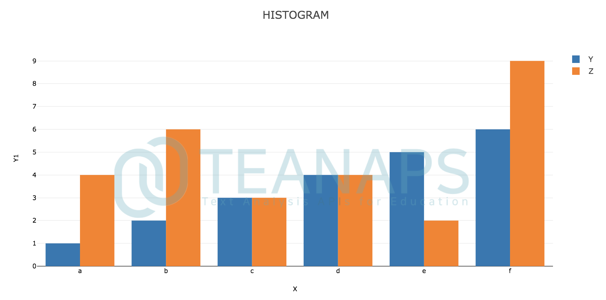
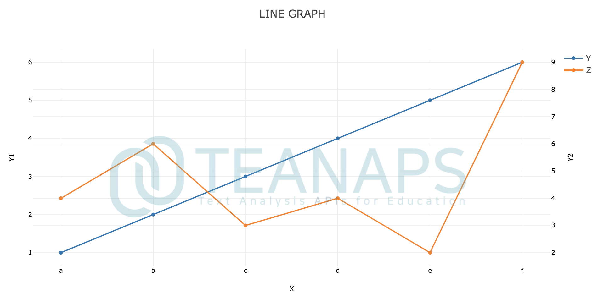
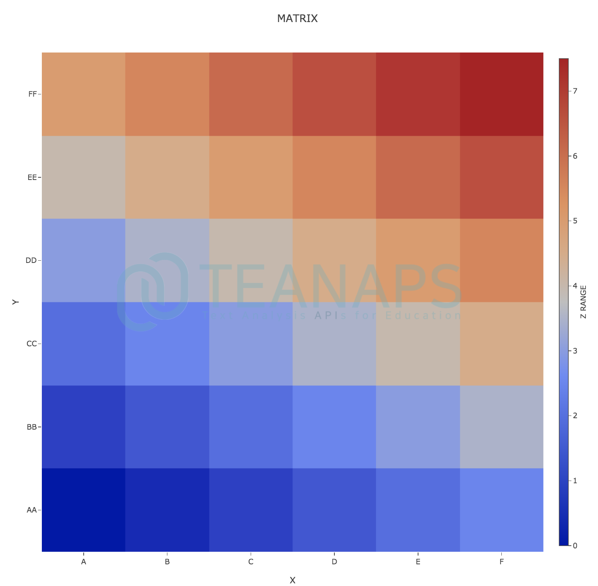
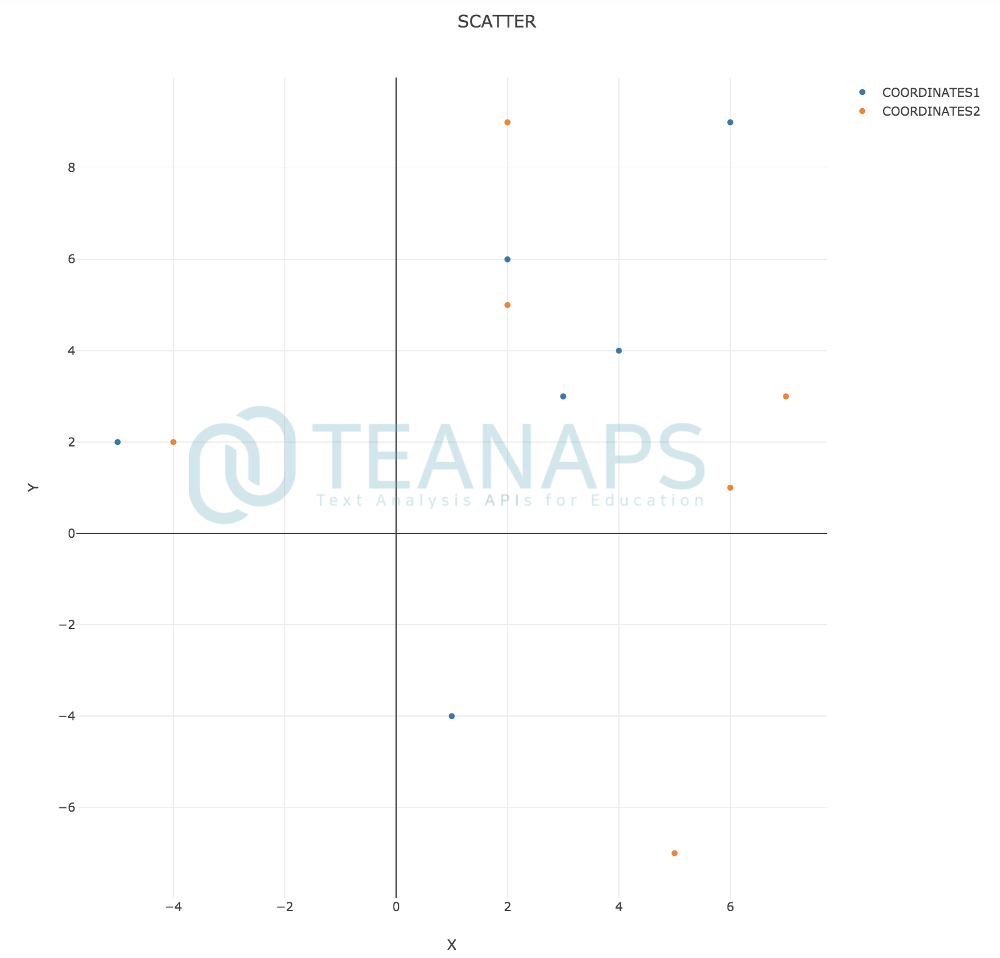
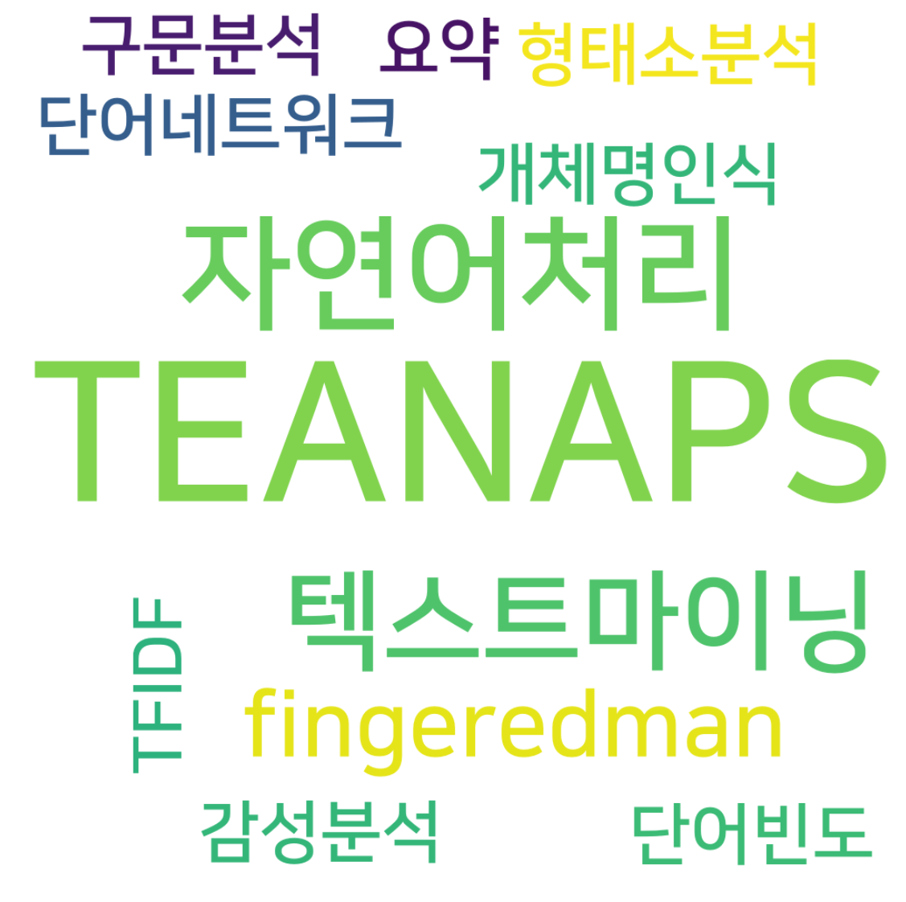
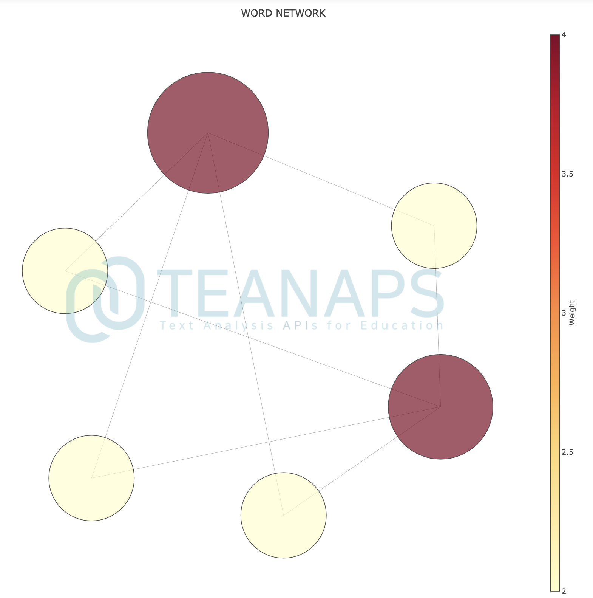

# `TEANAPS` User Guide

---
## Contents
- [Install `TEANAPS`](./teanaps_user_guide-install_teanaps.md)
- [API Documentation](./teanaps_user_guide-api_documentation-handler.md)
  - [Handler](./teanaps_user_guide-api_documentation-handler.md)
  - [NLP](./teanaps_user_guide-api_documentation-nlp.md)
  - [Text Analysis](./teanaps_user_guide-api_documentation-text_analysis.md)
  - [Visualization](./teanaps_user_guide-api_documentation-visualization.md)
  - [Machine Learning](./teanaps_user_guide-api_documentation-machine-learning.md)
- [Tutorial](./teanaps_user_guide-tutorial.md)
- [References](./teanaps_user_guide-references_journal_project.md)
- [Journal & Project](./teanaps_user_guide-references_journal_project.md)
- [Appendix](./teanaps_user_guide-appendix.md)

---
## API Documentation

### `TEANAPS` Architecture

```python
├─teanaps  
│     │  
│     ├─ handler  
│     │     ├─ FileHandler  
│     │     ├─ MessageHandler  
│     │     └─ QueueHandler  
│     │  
│     ├─ nlp
│     │     ├─ MorphologicalAnalyzer
│     │     ├─ NamedEntityRecognizer
│     │     ├─ SyntaxAnalyzer 
│     │     ├─ Processing 
│     │     └─ Embedding 
│     │ 
│     ├─ text_analysis 
│     │     ├─ TfidfCalculator 
│     │     ├─ DocumentClustering
│     │     ├─ TopicClustering 
│     │     ├─ CoWordCalculator
│     │     ├─ SentimentAnalysis
│     │     ├─ DocumentSummarizer 
│     │     └─ KeyphraseExtraction
│     │  
│     ├─ visualization
│     │     ├─ GraphVisualizer
│     │     └─ TextVisualizer 
│     │  
│     └─ machine_learning
│           ├─ Regression
│           ├─ Classification
│           └─ Clustering
└─────────────────────────────────────────
```

### Jump to

| Package   | Class     |
|-----------|-----------|
| [handler](./teanaps_user_guide-api_documentation-handler.md#1-teanapshandler)    | [FileHandler](./teanaps_user_guide-api_documentation-handler.md#11-teanapshandlerfilehandler), [MessageHandler](./teanaps_user_guide-api_documentation-handler.md#12-teanapshandlermessagehandler), [QueueHandler](./teanaps_user_guide-api_documentation-handler.md#13-teanapshandlerqueuehandler)    |
| [nlp](./teanaps_user_guide-api_documentation-nlp.md#2-teanapsnlp)    | [MorphologicalAnalyzer](./teanaps_user_guide-api_documentation-nlp.md#21-teanapsnlpmorphologicalanalyzer), [NamedEntityRecognizer](./teanaps_user_guide-api_documentation-nlp.md#22-teanapsnlpnamedentityrecognizer), [SyntaxAnalyzer](./teanaps_user_guide-api_documentation-nlp.md#23-teanapsnlpsyntaxanalyzer), [Processing](./teanaps_user_guide-api_documentation-nlp.md#24-teanapsnlpprocessing), [Embedding](./teanaps_user_guide-api_documentation-nlp.md#25-teanapsnlpembedding)    |
| [text_analysis](./teanaps_user_guide-api_documentation-text_analysis.md#3-teanapstext_analysis)    | [TfidfCalculator](./teanaps_user_guide-api_documentation-text_analysis.md#31-teanapstext_analysistfidfcalculator), [DocumentClustering](./teanaps_user_guide-api_documentation-text_analysis.md#32-teanapstext_analysisdocumentclustering), [TopicClustering](./teanaps_user_guide-api_documentation-text_analysis.md#33-teanapstext_analysistopicclustering), [CoWordCalculator](./teanaps_user_guide-api_documentation-text_analysis.md#34-teanapstext_analysiscowordcalculator), [SentimentAnalysis](./teanaps_user_guide-api_documentation-text_analysis.md#35-teanapstext_analysissentimentanalysis), [DocumentSummarizer](./teanaps_user_guide-api_documentation-text_analysis.md#36-teanapstext_analysisdocumentsummarizer), [KeyphraseExtraction](./teanaps_user_guide-api_documentation-text_analysis.md#37-teanapstext_analysiskeyphraseextraction)    |
| [visualization](./teanaps_user_guide-api_documentation-visualization.md#4-teanapsvisualization)    | [GraphVisualizer](./teanaps_user_guide-api_documentation-visualization.md#41-teanapsvisualizationgraphvisualizer), [TextVisualizer](./teanaps_user_guide-api_documentation-visualization.md#42-teanapsvisualizationtextvisualizer)    |
| [machine_learning](./teanaps_user_guide-api_documentation-machine-learning.md#5-teanapsmachine_learning)    | [Regression](./teanaps_user_guide-api_documentation-machine-learning.md#51-teanapsmachine_learningregression), [Classification](./teanaps_user_guide-api_documentation-machine-learning.md#52-teanapsmachine_learningclassification), [Clustering](./teanaps_user_guide-api_documentation-machine-learning.md#53-teanapsmachine_learningclustering)    |

### Manual
#### 4. `teanaps.visualization`
##### 4.1. `teanaps.visualization.GraphVisualizer`

> Python Code (in Jupyter Notebook) :
> ```python
> from teanaps.vis import GraphVisualizer
>
> gv = GraphVisualizer()
> ```

- `teanaps.visualization.GraphVisualizer.draw_histogram(self, data_meta_list, graph_meta)` [[Top]](#teanaps-architecture)
  - 입력된 그래프 메타정보를 바탕으로 생성된 히스토그램 그래프를 출력합니다.
  - Parameters
    - *data_meta_list (list) : 그래프에 표현할 데이터 딕셔너리를 포함하는 리스트. Examples 참고.*
    - *graph_meta (dict) : 그래프 속성을 정의한 딕셔너리. Examples 참고.*
  - Returns
    - *plotly graph (graph object) : 히스토그램 그래프.*
  - Examples

    > Python Code (in Jupyter Notebook) :
    > ```python
    > x = ["a", "b", "c", "d", "e", "f"]
    > y = [1, 2, 3, 4, 5, 6]
    > z = [4, 6, 3, 4, 2, 9]
    > 
    > data_meta_list = []
    > 
    > data_meta = {
    >     "graph_type": "histogram",
    >     "data_name": "Y",
    >     "x_data": x,
    >     "y_data": y,
    >     "y_axis": "y1",
    > }
    > data_meta_list.append(data_meta)
    > 
    > data_meta = {
    >     "graph_type": "histogram",
    >     "data_name": "Z",
    >     "x_data": x,
    >     "y_data": z,
    >     "y_axis": "y1"
    > }
    > data_meta_list.append(data_meta)
    > 
    > graph_meta = {
    >     "title": "HISTOGRAM",
    >     "x_tickangle": 0,
    >     "y1_tickangle": 0,
    >     "y2_tickangle": 0,
    >     "x_name": "X",
    >     "y1_name": "Y1",
    >     "y2_name": "Y2",
    > }
    > 
    > gv.draw_histogram(data_meta_list, graph_meta)
    > ```
    > Output (in Jupyter Notebook) :
    > 

- `teanaps.visualization.GraphVisualizer.draw_line_graph(self, data_meta_list, graph_meta)` [[Top]](#teanaps-architecture)
  - 입력된 그래프 메타정보를 바탕으로 생성된 라인 그래프를 출력합니다.
  - Parameters
    - *data_meta_list (list) : 그래프에 표현할 데이터 딕셔너리를 포함하는 리스트. Examples 참고.*
    - *graph_meta (dict) : 그래프 속성을 정의한 딕셔너리. Examples 참고.*
  - Returns
    - *plotly graph (graph object) : 라인 그래프.*
  - Examples

    > Python Code (in Jupyter Notebook) :
    > ```python
    > x = ["a", "b", "c", "d", "e", "f"]
    > y = [1, 2, 3, 4, 5, 6]
    > z = [4, 6, 3, 4, 2, 9]
    > 
    > data_meta_list = []
    > 
    > data_meta = {
    >     "graph_type": "scatter",
    >     "data_name": "Y",
    >     "x_data": x,
    >     "y_data": y,
    >     "y_axis": "y1",
    > }
    > data_meta_list.append(data_meta)
    > 
    > data_meta = {
    >     "graph_type": "scatter",
    >     "data_name": "Z",
    >     "x_data": x,
    >     "y_data": z,
    >     "y_axis": "y2"
    > }
    > data_meta_list.append(data_meta)
    > 
    > graph_meta = {
    >     "title": "LINE GRAPH",
    >     "x_tickangle": 0,
    >     "y1_tickangle": 0,
    >     "y2_tickangle": 0,
    >     "x_name": "X",
    >     "y1_name": "Y1",
    >     "y2_name": "Y2",
    > }
    > 
    > gv.draw_line_graph(data_meta_list, graph_meta)
    > ```
    > Output (in Jupyter Notebook) :
    > 

- `teanaps.visualization.GraphVisualizer.draw_matrix(self, data_meta_list, graph_meta)` [[Top]](#teanaps-architecture)
  - 입력된 그래프 메타정보를 바탕으로 생성된 매트릭스 그래프를 출력합니다.
  - Parameters
    - *data_meta (dict) : 그래프에 표현할 데이터 딕셔너리. Examples 참고.*
    - *graph_meta (dict) : 그래프 속성을 정의한 딕셔너리. Examples 참고.*
  - Returns
    - *plotly graph (graph object) : 매트릭스 그래프.*
  - Examples

    > Python Code (in Jupyter Notebook) :
    > ```python
    > x = ["A", "B", "C", "D", "E", "F"]
    > y = ["AA", "BB", "CC", "DD", "EE", "FF"]
    > x_data = []
    > y_data = []
    > z_data = []
    > for x_index in range(len(x)):
    >     for y_index in range(len(y)):
    >         x_data.append(x[x_index])
    >         y_data.append(y[y_index])
    >         z_data.append(x_index/2 + y_index)
    > 
    > data_meta = {
    >     "colorbar_title": "Z RANGE",
    >     "x_data": x_data,
    >     "y_data": y_data,
    >     "z_data": z_data
    > }
    > 
    > graph_meta = {
    >     "title": "MATRIX",
    >     "height": 1000, 
    >     "width": 1000,
    >     "y_tickangle": 0,
    >     "y_name": "Y",
    >     "x_tickangle": 0,
    >     "x_name": "X",
    > }
    > 
    > gv.draw_matrix(data_meta, graph_meta)
    > ```
    > Output (in Jupyter Notebook) :
    > 

- `teanaps.visualization.GraphVisualizer.draw_scatter(self, data_meta_list, graph_meta)` [[Top]](#teanaps-architecture)
  - 입력된 그래프 메타정보를 바탕으로 생성된 산점도 그래프를 출력합니다.
  - Parameters
    - *data_meta_list (list) : 그래프에 표현할 데이터 딕셔너리를 포함하는 리스트. Examples 참고.*
    - *graph_meta (dict) : 그래프 속성을 정의한 딕셔너리. Examples 참고.*
  - Returns
    - *plotly graph (graph object) : 산점도 그래프.*
  - Examples

    > Python Code (in Jupyter Notebook) :
    > ```python
    > x1 = [1, 2, 3, 4, -5, 6]
    > y1 = [-4, 6, 3, 4, 2, 9]
    > label1 = ["a", "b", "c", "d", "e", "f"]
    > 
    > x2 = [6, 7, 2, -4, 5, 2]
    > y2 = [1, 3, 5, 2, -7, 9]
    > label2 = ["A", "B", "C", "D", "E", "F"]
    > 
    > data_meta_list = []
    > 
    > data_meta = {
    >     "data_name": "COORDINATES1",
    >     "x_data": x1,
    >     "y_data": y1,
    >     "label": label1
    > }
    > data_meta_list.append(data_meta)
    > 
    > data_meta = {
    >     "data_name": "COORDINATES2",
    >     "x_data": x2,
    >     "y_data": y2,
    >     "label": label2
    > }
    > data_meta_list.append(data_meta)
    > 
    > graph_meta = {
    >     "title": "SCATTER",
    >     "x_name": "X",
    >     "y_name": "Y"
    > }
    > 
    > gv.draw_scatter(data_meta_list, graph_meta)
    > ```
    > Output (in Jupyter Notebook) :
    > 

##### 4.2. `teanaps.visualization.TextVisualizer`

> Python Code (in Jupyter Notebook) :
> ```python
> from teanaps.vis import TextVisualizer
>
> gv = TextVisualizer()
> ```

- `teanaps.visualization.Textisualizer.draw_sentence_attention(token_list, weight_list)` [[Top]](#teanaps-architecture)
  - 형태소 단위로 분리된 문장과 각 형태소별 가중치를 바탕으로 문장의 특정 부분을 하이라이트한 형태의 문장 그래프로 출력합니다.
  - Parameters
    - *token_list (list) : 형태소 단위로 분리된 문장의 각 형태소를 포함하는 리스트.*
    - *weight_list (list) : 형태소 단위로 분리된 문장의 각 형태소에 해당하는 가중치를 포함하는 리스트.*
  - Returns
    - *plotly graph (graph object) : 문장 그래프.*
  - Examples

    > Python Code (in Jupyter Notebook) :
    > ```python
    > sentence = "문장에서 중요한 부분을 음영으로 강조하여 표현하기 위해 사용됩니다."
    > token_list = sentence.split(" ")
    > #token_list = ['문장에서', '중요한', '부분을', "음영으로", '강조하여', '표현하기', '위해', '사용됩니다.']
    > weight_list = [1, 5, 2, 1, 4, 2, 1, 1]
    > 
    > tv.draw_sentence_attention(token_list, weight_list)
    > ```
    > Output (in Jupyter Notebook) :
    > 

	> Python Code (in Jupyter Notebook) :
    > ```python
    > sentence = "가중치가 양수면 파란색, 음수면 빨간색으로 음영을 표현합니다."
    > token_list = sentence.split(" ")
    > #token_list = ['가중치가', '양수면', '파란색,', "음수면", '빨간색으로', '표현합니다.']
    > weight_list = [1, 5, 2, 1, 4, 2, 1, 1]
    > 
    > tv.draw_sentence_attention(token_list, weight_list)
    > ```
    > Output (in Jupyter Notebook) :
    > 

- `teanaps.visualization.Textisualizer.draw_wordcloud(data_meta, graph_meta)` [[Top]](#teanaps-architecture)
  - 단어와 그 가중치를 바탕으로 생성된 워드클라우드 이미지를 출력합니다.
  - Parameters
    - *data_meta (dict) : 그래프에 표현할 데이터 딕셔너리. Examples 참고.*
    - *graph_meta (dict) : 그래프 속성을 정의한 딕셔너리. Examples 참고.*
  - Returns
    - *figure (matplotlib.pyplot.plt) : 워드클리우드.*
  - Examples

    > Python Code (in Jupyter Notebook) :
    > ```python
    > tf = {
    >     "TEANAPS": 10,
    >     "teanaps.com": 4,
    >     "fingeredman": 2,
    >     "텍스트마이닝": 3,
    >     "자연어처리": 4,
    >     "감성분석": 1,
    >     "단어빈도": 1,
    >     "TFIDF": 1,
    >     "요약": 1,
    >     "단어네트워크": 1,
    >     "형태소분석": 1,
    >     "개체명인식": 1,
    >     "구문분석": 1
    > }
    > 
    > data_meta = {
    >     "weight_dict": tf,
    > }
    > 
    > graph_meta = {
    >     "height": 1000, 
    >     "width": 1000,
    >     "min_font_size": 10,
    >     "max_font_size": 500,
    >     "margin": 10,
    >     "background_color": "white"
    > }
    > 
    > tv.draw_wordcloud(data_meta, graph_meta)
    > ```
    > Output (in Jupyter Notebook) :
    > 

- `teanaps.visualization.Textisualizer.draw_network(data_meta, graph_meta)` [[Top]](#teanaps-architecture)
  - 단어와 그 가중치, 그리고 순서쌍을 바탕으로 생성된 네트워크 이미지를 출력합니다.
  - Parameters
    - *data_meta (dict) : 그래프에 표현할 데이터 딕셔너리. Examples 참고.*
    - *graph_meta (dict) : 그래프 속성을 정의한 딕셔너리. Examples 참고.*
  - Returns
    - *plotly graph (graph object) : 네트워크 그래프.*
  - Examples

    > Python Code (in Jupyter Notebook) :
    > ```python
    > data_meta = {
    >     "node_list": ["a", "b", "c", "d", "e", "f"],
    >     "edge_list": [("a", "b", None), ("c", "d", None), ("a", "c", None), ("b", "d", None),
    >                   ("a", "f", None), ("a", "e", None), ("e", "d", None), ("d", "f", None)],
    >     "weight_dict": {
    >         "a": 4,
    >         "b": 2,
    >         "c": 2,
    >         "d": 3,
    >         "e": 2,
    >         "f": 2
    >     }
    > }
    > 
    > graph_meta = {
    >     "title": "WORD NETWORK",
    >     "height": 1000, 
    >     "width": 1000,
    >     "weight_name": "Weight",
    > }
    > 
    > tv.draw_network(data_meta, graph_meta)
    > ```
    > Output (in Jupyter Notebook) :
    > 
